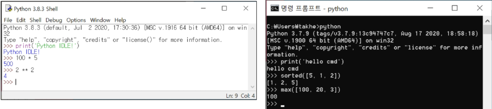
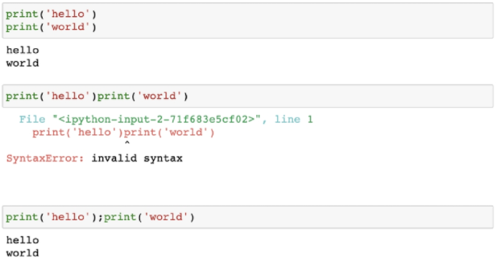
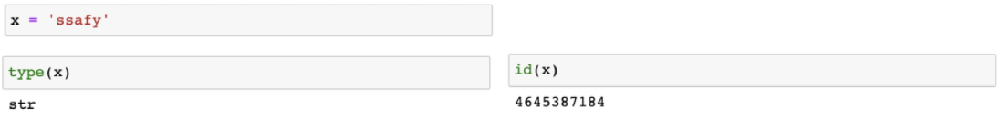
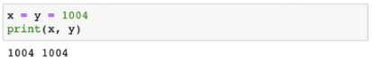
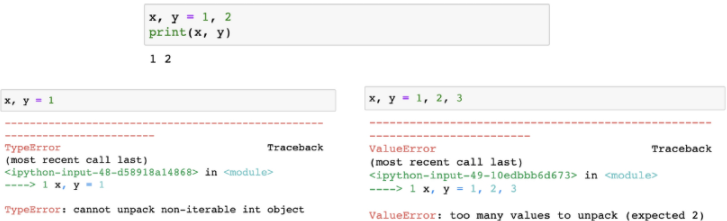
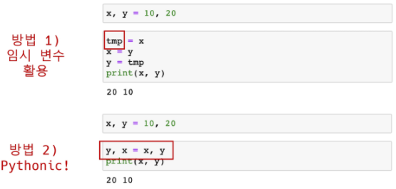
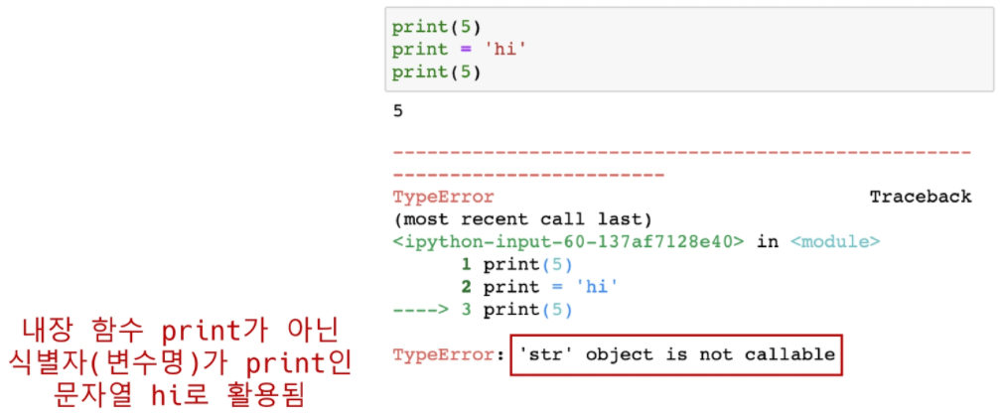
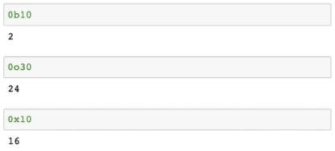

# [Python 기초]

## Python 개발 환경

### Python 특징

##### ⋅ 인터프리터 언어 (Interpreter)

  ⋅ 소스 코드를 컴파일하지 않고, 한 줄씩 소스코드를 읽어서 바로 실행  
  ⋅ 컴파일 언어에 비해 느릴 수 있지만 빌드 과정이 없이 바로 실행 가능함

##### ⋅ 객체 지향 프로그래밍 (Object Oriented Programming)

  ⋅ 파이썬은 모두 객체로 이루어져 있음

##### ⋅ 동적 타이핑 (Dynamic Typing)

  ⋅ 변수에 별도의 타입 지정이 필요 없음

### Python 개발 환경

##### ⋅ 대화형 환경

  ⋅ Python 기본 Interpreter  
  ⋅ Python Jupyter Notebook

##### ⋅ 스크립트 실행

  ⋅ .py 파일을 작성하고 IDE 혹은 Text editor 활용

### Python Interpreter / IDLE

##### ⋅ 인터프리터가 대화형 모드로 동작

  ⋅ 프롬프트(>>>)에 코드를 작성하면 해당 코드가 실행됨  
  ⋅ 여러 줄의 코드가 작성되는 경우 보조 프롬프트(...)가 사용됨

> Python이 설치된 환경에서는 기본적으로 활용 가능하나 디버깅 및 코드 편집, 반복 실행이 어려움



### Python Jupyter Lab

##### ⋅ 웹 브라우저 환경에서 코드를 작성할 수 있는 오픈소스

  ⋅ Syntax Highlighting, Indentation, Tab completion 등 편의 기능 제공함  
  ⋅ 브라우저에서 코드를 실행하고 결과를 확인할 수 있음  
  ⋅ HTML, LaTeX, PNG, SVG을 바탕으로 다양한 표현이 가능함  
  ⋅ Markdown을 기반으로 문서를 작성할 수 있음

> 데이터분석/머신러닝/딥러닝 시 많이 활용 가능하며, Google colab 등 유사한 환경의 서비스들도 있음


## Python 기초 문법

### 코드 스타일 가이드

##### ⋅ 코드를 '어떻게 작성할지'에 대한 가이드라인

  ⋅ PEP8 (https://www.python.org/dev/peps/pep-0008/)  - 파이썬에서 제안하는 스타일 가이드  
  ⋅ Google Style guide (https://google.github.io/styleguide/pyguide.html) 등 기업, 오픈소스 등에서 사용

### 주석(Comment)

##### ⋅ 한 줄 주석은 #으로 표현

```python
# 주석(comment)입니다.

# print('hello')
print('world')
```

> world

##### ⋅ 특수한 형태의 주석 'docstring'

  ⋅ 함수/클래스의 설명을 작성

```python
def foo():
	"""이 함수는 foo입니다.
	docstring으로 함수나 클래스의 기능을 설명합니다."""
```

### 코드 라인

##### ⋅ 코드는 1줄에 1문장(statement)이 원칙

##### ⋅ 문장(statement)은 파이썬이 실행 가능(executable)한 최소한의 코드 단위

  ⋅ 기본적으로 파이썬에서는 세미콜론(;)을 작성하지 않음  
  ⋅ 한 줄로 표기할 때는 세미콜론(;)를 작성하여 표기할 수 있음




## 변수와 식별자

### 변수

##### ⋅ 변수는 할당 연산자(=)를 통해 값을 할당 (assignment)

##### ⋅ type() : 변수에 할당된 값의 타입

##### ⋅ id() : 변수에 할당된 값(객체)의 고유한 아이덴티티(identity) 값이며, 메모리 주소



### 할당 연산자(=)

##### ⋅ 같은 값을 동시에 할당할 수 있음



##### ⋅ 다른 값을 동시에 할당할 수 있음 (multiple assignment)



### 값 swap

##### ⋅ x = 10, y = 20 일 때, 각각 값을 바꿔서 저장하는 코드



### 식별자 (identifiers)

##### ⋅ 변수, 함수, 모듈, 클래스 등을 식별하는데 사용하는 이름(name)

##### ⋅ 규칙

> ⋅ 식별자의 이름은 영문 알파벳, 언더스코어(_), 숫자로 구성  
> ⋅ 첫 글자에 숫자가 올 수 없음  
> ⋅ 길이제한이 없고, 대소문자를 구별  
> ⋅ 다음의 키워드(keywords)는 예약어(reserved words)로 사용할 수 없음

```
False, None, True, and, as, assert, async, await, break, class, continue,
def, del, elif, else, except, finally, for, from, global, if, import, in,
is, lambda, nonlocal, not, or, pass, raise, return, try, while, with, yield
```

##### ⋅ 내장함수나 모듈 등의 이름으로도 만들면 안됨




## 데이터 타입

### 숫자 (int)

##### ⋅ 모든 정수의 타입은 int

  ⋅ Python 3부터는 long 타입은 없고, 모두 int로 표기  
  ⋅ 여타 프로그래밍 언어, Python 2에서는 OS기준 32/64비트

##### ⋅ 매우 큰 수를 나타낼 때 오버플로가 발생하지 않음

  ⋅ 오버플로(overflow) : 데이터 타입별로 사용할 수 있는 메모리의 크기를 넘어서는 상황  
  ⋅ Arbitrary precision arithmetic(임의 정밀도 산술)을 통해 고정된 형태의 메모리가 아닌 가용 메모리들을 활용하여 모든 수 표현에 활용


##### ⋅ 진수 표현

  ⋅ 2진수 : 0b  
  ⋅ 8진수 : 0o  
  ⋅ 16진수 : 0x



