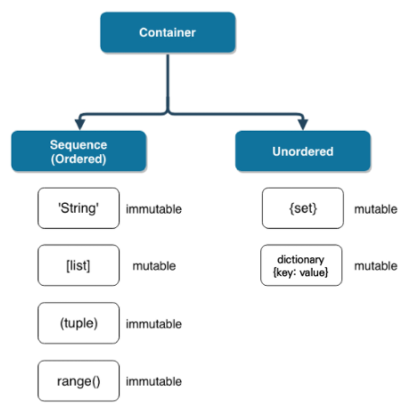
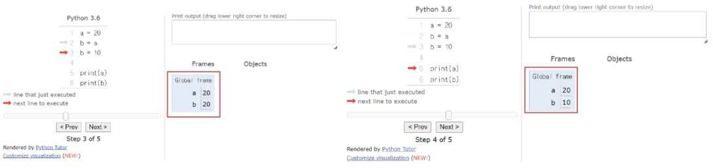
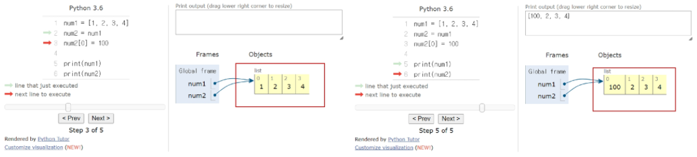
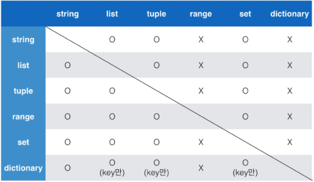
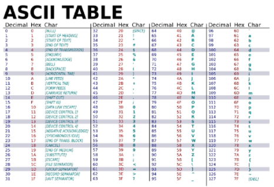

# 컨테이너

## 컨테이너 특징

##### · 여러 개의 값을 저장할 수 있는 것 (객체)

##### · 시퀀스(sequence)형 : 순서가 있는 (ordered) 데이터

  · 순서가 있다 != 정렬되어 있다  
  · 리스트(list), 튜플(tuple), 레인지(range), 문자형(string), 바이너리(binary)

##### · 비시퀀스(non-sequence)형 : 순서가 없는 (unordered) 데이터

  · 세트(set), 딕셔너리(dictionary)

### 컨테이너 분류



##### · 변경 불가능한 데이터 (immutable)

  · 리터럴(literal) - 숫자(Number), 문자열(String), 참/거짓(Bool)  
  · range  
  · tuple



  →  b = a (복사)를 하면 같은 값이 공유되며, b = 10을 통해 재할당이 발생

##### · 변경 가능한 데이터 (mutable)

  · list  
  · set  
  · dictionary



  →  num2 = num1 (복사)을 하는 경우 동일한 리스트(객체)의 주소를 참조  
        num2[0] = 100으로 변경하게 되면 해당 리스트의 첫번째 원소 값이 변경됨

### 컨테이너 형변환

##### · 컨테이너 간의 형변환은 아래와 같이 가능




## 시퀀스형 컨테이너

### 리스트 (list)

##### · 리스트는 순서가 있는 시퀀스로 인덱스를 통해 접근 (인덱스는 0부터 시작)

  · 대괄호([]) 혹은 list()를 통해 생성  
  · 값에 대한 접근은 list[i]

```python
print([1, 2, 3])
print(type([1, 2, 3]))
```

> [1,   2,   3]  
> <class  'list'>

```python
list((1, 2, 3))
```

> [1,   2,   3]

```python
# 값 접근
a = [1, 2, 3]
print(a[0])

# 값 변경
a[0] = '1' # 서로 다른 타입의 데이터를 저장할 수 있음
print(a)
```

> 1  
> ['1',   2,   3]

```python
# 중첩 리스트 실습문제
a = [[1, 2], [3, 5]]
print(a[0][1])
```

> 2

### 튜플(tuple)

##### · 튜플은 수정 불가능한(immutable) 시퀀스로 인덱스로 접근

  · 소괄호(()) 혹은 tuple()을 통해 생성  

```python
print((1, 2, 3, 1))
print(type((1, 2, 3, 1)))
```

> (1,  2,  3,  1)  
> tuple

```python
tuple((1, 2, 3, 1))
```

> (1,  2,  3,  1)

  · 값에 대한 접근은 my_tuple(i)

```python
a = (1, 2, 3, 1)
a[1]
```

> 2

```python
# 값 변경 => 불가능 (tuple은 immutable)
a[1] = '3'
```

> TypeError: 'tuple' object does not support item assignment

##### · 튜플은 일반적으로 파이썬 내부에서 활용됨

  · multiple assignment  

```python
x, y = 1, 2
print(x, y)
```

> 1  2

```python
# 실제로 tuple로 처리
x, y = (1, 2)
print(x, y)
```

> 1  2

```python
# 두 변수의 값 swap
x, y = 1, 2
x, y = y, x
print(x, y)
```

> 2  1

  · 추후 함수에서 복수의 값을 반환하는 경우에도 활용

```python
print(divmod(5, 2))
quotient, remainder = divmod(5, 2)
print(quotient, remainder)
```

> (2,  1)  
> 2  1

```python
print(type(divmod(5, 2)))
```

> <class  'tuple'>

##### · 하나의 항목으로 구성된 튜플은 생성시 값 뒤에 쉼표를 붙여야 함

```python
a = (1)
b = (1, )
print(type(a))
print(type(b))
```

> <class  'int'>  
> <class  'tuple'>

### 레인지(range)

##### · range는 숫자의 시퀀스를 나타내기 위해 사용

  · 기본형 : range(n)  
		  · 0부터 n-1까지의 숫자의 시퀀스 

```python
print(range(4))
print(type(range(4)))
```

> range(0, 4)  
> <class 'range'>

  · 범위 지정 : range(n, m)  
  		· n부터 m-1까지의 숫자의 시퀀스

```python
list(range(1, 5))
```

> [1,  2,  3,  4]

  · 범위 및 스텝 지정 : range(n, m, s)  
  		· n부터 m-1까지 s만큼 증가시키는 숫자의 시퀀스

```python
list(range(1, 5, 2))
```

> [1,  3]

```python
list(range(6, 1, -1))
```

> [6,  5,  4,  3,  2]


## 시퀀스에서 활용하는 연산자/함수

### containment test

##### · 시퀀스 포함 여부 확인

  · in

```python
# 리스트
1 in [3, 2]
```

> False

```python
# 튜플
4 in (1, 2, 'hi')
```

> False

```python
# range
-3 in range(3)
```

> False

```python
# 문자열
'a' in 'apple'
```

> True

  · not in

```python
'b' not in 'apple'
```

> True

### concatenation(+)

##### · 시퀀스 간의 concatenation(연결/연쇄)

  · range는 TypeError 발생

```python
# 리스트
[1, 2] + ['a']
```

> [1,  2,  'a']

```python
# 튜플
(1, 2) + ('a',)
```

> (1,  2,  'a')

```python
# range
range(2) + range(2, 5)
```

> TypeError: unsupported operand type(s) for +: 'range' and 'range'

```python
# 문자열
'12' + 'b'
```

> '12b'

### 시퀀스 반복(*)

##### · 시퀀스를 반복

  · range는 TypeError

```python
# 리스트
[0] * 8
```

> [0,  0,  0,  0,  0,  0,  0,  0]

```python
# 튜플
(1, 2) * 3
```

> (1,  2,  1,  2,  1,  2)

```python
# range
range(1) * 3
```

> TypeError: unsupported operand type(s) for *: 'range' and 'int'

```python
# 문자열
'hi' * 3
```

> 'hihihi'

### 인덱싱(indexing)

##### · 시퀀스의 특정 인덱스 값에 접근

  · 해당 인덱스가 없는 경우 IndexError

```python
# 리스트
[1, 2, 3][2]
```

> 3

```python
# 튜플
(1, 2, 3)[0]
```

> 1

```python
# range
range(3)[2]
```

> 2

```python
# 문자열
'abc'[0]
```

> 'a'

```python
[1, 2, 3][100]
```

> IndexError: list index out of range

### 슬라이싱(slicing)

##### · 시퀀스를 특정 단위로 슬라이싱

```python
# 리스트
[1, 2, 3, 5][1:4]
```

> [2,  3,  5]

```python
# 튜플
(1, 2, 3)[:2]
```

> (1,  2)

```python
# range
range(10)[5:8]
```

> range(5,  8)

```python
# 문자열
'abcd'[2:4]
```

> 'cd'

##### · 시퀀스를 k간격으로 특정 단위로 슬라이싱

```python
# 리스트
[1, 2, 3, 5][0:4:2]
```

> [1,  3]

```python
# 튜플
(1, 2, 3, 5)[0:4:2]
```

> (1,  3)

```python
# range
range(10)[1:5:3]
```

> range(1,  5,  3)

```python
# 문자열
'abcdefg'[1:3:2]
```

> 'b'

### 길이

##### · 시퀀스의 길이

```python
# 리스트
len([1, 2, 3])
```

> 3

```python
# 튜플
len((1, 2, 3))
```

> 3

```python
# range
len(range(100))
```

> 100

```python
# 문자열
len('apple')
```

> 5

### 최소/최대

##### · 시퀀스에서의 최솟/최댓값

  · 문자열은 ascii 코드에 따름  
  · ord함수 활용하여 확인 가능



```python
# 리스트
min([1, 100, 59])
```

> 1

```python
# 튜플
max((-10, 20, 5))
```

> 20

```python
# range
max(range(-100, 2))
```

> 1

```python
# 문자열
print(max('abcd1234%^!'))
print(min('abcd1234%^!'))
```

> 'd'  
> '!'

### count

##### · 시퀀스에서의 특정 원소의 개수

  · 시퀀스에 등장하지 않는 경우 0 반환

```python
# 리스트
[1, 2, 1, 2, 4].count(1)
```

> 2

```python
# 튜플
(1, 2, 3, 1, 1).count(1)
```

> 3

```python
# range
range(5).count(5)
```

> 0

```python
# 문자열
'apple'.count('p')
```

> 2

### 시퀀스 연산자/함수 실습문제

```python
([1, 2]*2 + ['apple', 'banana'])[4].count('a') in range(2, 5)
```

> False


## 비시퀀스형 컨테이너

### 세트(set)

##### · 순서가 없는 자료구조

​	· 중괄호({}) 혹은 set()을 통해 생성  
​		· 빈 세트를 만들기 위해서는 set()을 반드시 활용해야 함

```python
print({1, 2, 3, 1, 2})  # 중복 값 제거
print(type({1, 2, 3}))
```

> {1,  2,  3}  
> <class  'set'>

```python
blank = {}  # 빈 중괄호는 딕셔너리
print(type(blank))
```

> <class  'dict'>

```python
blank_set = set()
print(type(set()))
```

> <class  'set'>

​	· 순서가 없어 별도의 값에 접근할 수 없음

```python
{1, 2, 3}[0]
```

> TypeError: 'set' object is not subscriptable

##### · 수학에서의 집합과 동일한 구조를 가짐

​	· 집합 연산이 가능

```python
set_a = {1, 2, 3}
set_b = {3, 6, 9}
```

```python
# 차집합
print(set_a - set_b)

# 합집합
print(set_a | set_b)

# 교집합
print(set_a & set_b)
```

> {1,  2}  
> {1,  2,  3,  6,  9}  
> {3}

​	· 중복된 값이 존재하지 않음 (중복된 값을 쉽게 제거할 수 있지만, 이후 순서가 무시됨)

```python
my_list = ['서울', '서울', '대전', '광주',
		   '서울', '대전', '부산', '부산']
```

```python
len(set(my_list))
```

> 4

```python
set(my_list)  # set를 사용하는 순간 순서가 사라짐
```

> {'광주',  '대전',  '부산',  '서울'}

### 딕셔너리 (dictionary)

##### · key와 value가 쌍으로 이뤄진 자료구조

​	· 중괄호({}) 혹은 dict()을 통해 생성

```python
dict_a = {}
print(type(dict_a))
```

> <class  'dict'>

```python
dict_b = dict()
print(type(dict_b))
```

> <class  'dict'>

​	· key를 통해 value에 접근

```python
dict_a = {'a': 'apple', 'b': 'banana', 'list': [1, 2, 3]}
print(dict_a)
```

> {'a' :  'apple',  'b' :  'banana',  'list' :  [1,  2,  3]}

```python
dict_a['list']
```

>[1,  2,  3]

```python
dict_b = dict(a='apple', b='banana', list=[1, 2, 3])
print(dict_b)
```

> {'a' :  'apple',  'b' :  'banana' ,  'list' :  [1,  2,  3]}

​	· key는 변경 불가능한 데이터(immutable)만 활용 가능  
​      (string,  integer,  float,  boolean,  tuple,  range)

​	· value는 모든 값으로 설정 가능 (리스트, 딕셔너리 등)

```python
dict_c = {[1, 2, 3] = 'hi'}
```

> TypeError:  unhashable  type:  'list'

```python
dict_d = {'a': 'apple', 3: '삼', '지역': ['서울', '광주']}
print(dict_d['지역'][0])
```

> 서울

### 리스트 딕셔너리 실습

```python
movie = {
	'adult': False,
	'genres': [
		'드라마',
		'스릴러'
	],
	'id': 278,
	'original_language': 'en',
	'title': '쇼생크 탈출'
}
```

```python
print(movie['genres'])
print(movie['genres'][0])
```

> ['드라마',  '스릴러']  
> 드라마
