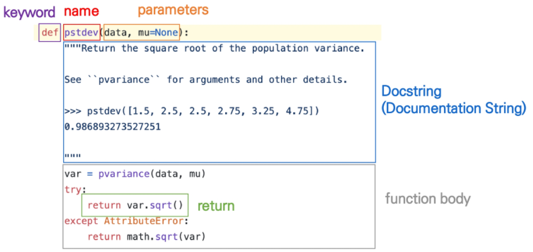
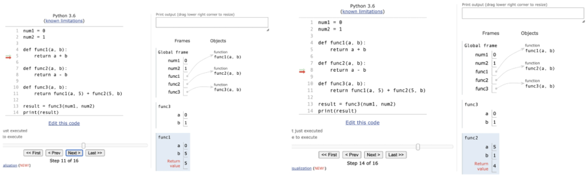
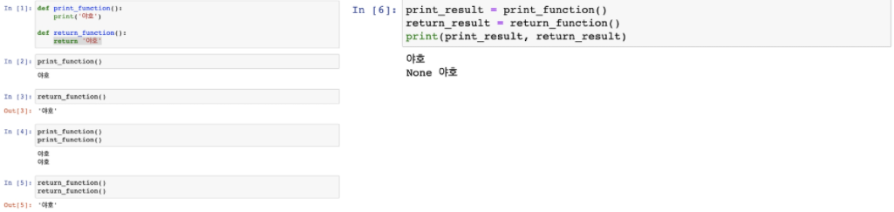

# 함수 (Function)

> ##### · 특정한 기능을 하는 코드의 조각(묶음)
>
> ##### · 하나의 큰 프로그램을 여러 부분으로 나누어 같은 함수를 여러 상황에서 호출하고(높은 재사용성), 일부분을 수정하기 쉽다(유지보수 용이)는 장점을 가짐

```python
print('hi')
```

> hi

```python
x = -3
y = abs(x)
print(x, y)
```

> -3  3

```python
y = abs(-3) + sum([1, 2, 3])
print(y)
```

> 9

### 함수를 사용해야 하는 이유 (표준편차 구하기)

##### · 내장함수 활용

```python
import math
values = [100, 75, 85, 90, 65, 95, 90, 60, 85, 50, 90, 80]
cnt = len(values)
mean = sum(values) / cnt
sum_var = sum(pow(value - mean, 2) for value in values) / cnt
std_dev = math.sqrt(sum_var)
print(std_dev)
```

> 14.499760534421096

##### · pstdev 함수 (파이썬 표준 라이브러리 - statistics)

```python
import statistics
values = [100, 75, 85, 90, 65, 95, 90, 60, 85, 50, 90, 80]
print(statistics.pstdev(values))
```

> 14.499760534421096

### 함수 기본 구조

> · 함수의 이름  
> · 함수의 매개변수(parameters)  
> · 함수의 바디(body) - Docstring(선택적) 및 코드셋  
> · 함수의 반환값(return)



### 내장 함수 (Built-in Functions)

##### · 파이썬 인터프리터에는 항상 사용할 수 있는 많은 함수와 형(type)이 내장되어 있음

|               |             | 내장 함수    |              |                  |
| ------------- | ----------- | :----------- | ------------ | ---------------- |
| abs()         | delattr()   | hash()       | memoryview() | set()            |
| all()         | dict()      | help()       | min()        | setattr()        |
| any()         | dir()       | hex()        | next()       | slice()          |
| ascii()       | divmod()    | id()         | object()     | sorted()         |
| bin()         | enumerate() | input()      | oct()        | staticmethod()   |
| bool()        | eval()      | int()        | open()       | str()            |
| breakpoint()  | exec()      | isinstance() | ord()        | sum()            |
| bytearray()   | filter()    | issubclass() | pow()        | super()          |
| bytes()       | float()     | iter()       | print()      | tuple()          |
| callable()    | format()    | len()        | property()   | type()           |
| chr()         | frozenset() | list()       | range()      | vars()           |
| classmethod() | getattr()   | locals()     | repr()       | zip()            |
| compile()     | globals()   | map()        | reversed()   | \_\_import\_\_() |
| complex()     | hasattr()   | max()        | round()      |                  |

(https://docs.python.org/ko/3/library/functions.html)

### 함수의 선언

##### · 함수의 선언은 def 키워드를 활용함

##### · 들여쓰기를 통해 함수 body(실행될 코드 블록)를 작성함

​	·  Docstring은 함수 body 앞에 선택적으로 작성 가능  
​		· 작성시에는 반드시 첫번째 문장에 문자열 """ """

##### · 함수는 매개변수(parameter)를 넘겨줄 수도 있음

##### · 함수는 동작 후에 return을 통해 결과값을 전달함

​	· 반드시 하나의 객체를 반환

```python
def foo():
	return True
	
def add(x, y):
	return x + y
```

### 함수의 호출

##### · 함수는 함수명()으로 호출

​	· 매개변수가 있는 경우, 함수명(값1, 값2, ...)로 호출

```python
num1 = 0
num2 = 1

def func1(a, b):
    return a + b

def func2(a, b):
    return a - b

def func3(a, b):
    return func1(a, 5) + func2(5, b)

result = func3(num1, num2)
print(result)
```

> 9




## 함수 output

### 함수의 리턴 (return)

##### · 함수는 항상 반환되는 값이 있으며, 어떠한 객체라도 상관 없음

##### · 오직 한 개의 객체만 return 됨

​	· 복수의 객체를 return 하는 경우

```python
def foo(a, b):
	return a+b, a-b
```

```python
print(foo(1, 2))
prnt(type(foo(1, 2)))
```

> (3,  -1)  
> tuple

  →  하나의 객체(tuple)를 반환

​	· 명시적인 return 값이 없는 경우

```python
def greeting():
	print('hi')
```

```python
print(greeting())
print(type(greeting()))
```

> hi  
> NoneType

  →  하나의 객체(None)를 반환

### 주의 - return vs print

##### · return은 함수 안에서만 사용되는 키워드

##### · print는 출력을 위해 사용되는 함수

##### · REPL(Read-Eval-Print-Loop) 환경에서는 마지막으로 작성된 코드의 리턴 값을 보여주므로 같은 동작을 하는 것으로 착각할 수 있음




## 함수 input

### 위치 인자 (Positional Arguments)

