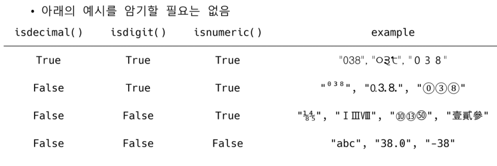
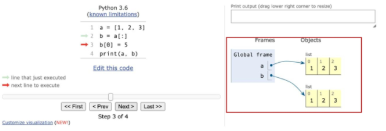
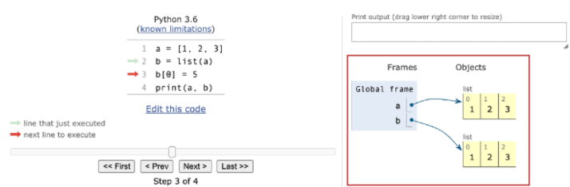
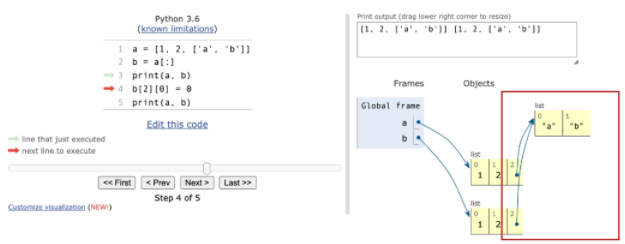
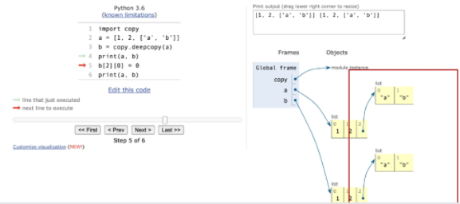

# 데이터 구조 (Data Structures)

> ##### · Algorithms + Data Structures = Programs (Niklaus Wirth, 파스칼 설계자 및 1984년 튜링상 수상자)
>
> ##### · 데이터에 편리하게 접근하고, 변경하기 위해 데이터를 저장하거나 조작하는 법
>
> ##### · 순서가 있는 데이터 구조
>
> > · 문자열(String)  
> > · 리스트(List)
>
> ##### · 순서가 없는 데이터 구조
>
> > · 세트(set)  
> > · 딕셔너리(Dictionary)


## 문자열

> ##### · 문자들의 나열 (sequence of characters)
>
> ##### · 문자열의 특징
>
> > · 변경할 수 없고 (immutable)  
> > · 순서가 있고 (ordered)  
> > · 순회 가능한 (iterable)

##### · Immutable

```python
a = 'my string?'
a[-1] = '!'
```

> TypeError :  'str' object does not support item assignment

##### · Iterable

```python
a = '123'
for char in a:
	print(char)
```

> 1  
> 2  
> 3

### 문자열 인덱스 (Index)

##### · 파이썬에서 문자열은 아래와 같이 접근할 수 있음

> 

### 문자열 자르기 (Slicing)

##### · 파이썬에서 문자열은 아래와 같이 자를 수 있음


> ##### · s[2 : 5]  =>  'cde'
>
> ##### · s[-6 : -2]  =>  'defg'
>
> ##### · s[2 : -4]  =>  'cde'
>
> ##### · s[2 : 5 : 2]  =>  'ce'
>
> ##### · s[-6 : -1 : 3]  =>  'dg'
>
> ##### · s[2 : 5 : -1]  =>  ''
>
> ##### · s[5 : 2 : -1]  =>  'fed'
>
> ##### · s[ : 3]  =>  'abc'
>
> ##### · s[5 : ]  =>  'fghi'
>
> ##### · s[ : : ]  =>  'abcdefghi'
>
> ​	· s[0 : len(s) : 1]과 동일
>
> ##### · s[ : : -1]  =>  'ihgfedcba'
>
> ​	· s[-1 : -(len(s)+1) : -1]과 동일

### 문자열

##### · 문자들의 나열 (sequence of characters)

##### · 문자열의 특징

> · 변경할 수 없고 (immutable)  
> · 순서가 있고 (ordered)  
> · 순회 가능한 (iterable)

### 문자열 조회/탐색

##### · .find(x)

​	· x의 첫 번째 위치를 반환. 없으면 -1을 반환함

```python
'apple'.find('p')
```

> 1

```python
'apple'.find('k')
```

> -1

##### · .index(x)

​	· x의 첫 번째 위치를 반환. 없으면 오류 발생

```python
'apple'.index('p')
```

> 1

```python
'apple'.index('k')
```

> ValueError :  substring not found

### 문자열 변경

##### · .replace(old, new[ ,count])

​	· 바꿀 대상 글자를 새로운 글자로 바꿔서 반환  
​	· count를 지정하면, 해당 개수만큼만 시행

```python
'coone'.replace('o', 'a')
```

> 'caane'

```python
'wooooowoo'.replace('o', '!', 2)
```

> 'w!!ooowoo'

##### · .strip([chars])

​	· 특정한 문자들을 지정하면 양쪽을 제거하거나(strip), 왼쪽을 제거하거나(lstrip), 오른쪽을 제거(rstrip)

##### · 문자열을 지정하지 않으면 공백을 제거함

```python
'	와우!\n'.strip()
```

> '와우!'

```python
'	와우!\n'.lstrip()
```

> '와우!\n'

```python
'	와우!\n'.rstrip()
```

> '		와우!'

```python
'안녕하세요????'.rstrip('?')
```

> '안녕하세요'

##### · .split([chars])

​	· 문자열을 특정한 단위로 나눠 리스트로 반환

```python
'a,b,c'.split('_')
```

> ['a,b,c']

```python
'a b c'.split()
```

> ['a',  'b',  'c']

##### · 'separator' .join([iterable])

​	· 반복가능한(iterable) 컨테이너 요소들을 separator(구분자)로 합쳐 문자열 반환

```python
'!'.join('hello')
```

> ' h ! e ! l ! l ! o'

```python
' '.join(['3', '5'])
```

> '3  5'

### · 대소문자 변경

> ·  .capitalize()  :  앞글자를 대문자로  
> ·  .title()  :  '나 공백 이후를 대문자로  
> ·  .upper()  :  모두 대문자로  
> ·  .lower()  :  모두 소문자로  
> ·  .swapcase()  :  대 <-> 소문자로 변경

```python
msg = 'hI! Everyone, I\\'m hello'
print(msg)
print(msg.capitalize())
print(msg.title())
print(msg.upper())
print(msg.lower())
print(msg.swapcase())
```

> hI!  Everyone,  I'm  hello  
> Hi!  everyone,  i'm  hello  
> Hi!  Everyone,  I'M  Hello  
> HI!  EVERYONE, I'M  HELLO  
> hi!  everyone,  i'm  hello  
> Hi!  eVERYONE,  i'M  HELLO

### 문자열 관련 검증 메소드

> ·  .isalpha()  :  알파벳 문자 여부  ( *단순 알파벳이 아닌 유니코드 상 Letter (한국어도 포함) )  
> ·  .isupper()  :  대문자 여부  
> ·  .islower()  :  소문자 여부  
> ·  .istitle()  :  타이틀 형식 여부

```python
print('abc'.isalpha())
print('ㄱㄴㄷ'.isalpha())
print('Ab'.isupper())
print('ab'.islower())
print('Title Title!'.istitle())
```

> True  
> True  
> False  
> True  
> True

##### · .isdecimal()  ⊆  .isdigit()  ⊆  .isnumeric()

```python
print('⅜'.isdecimal())
print('⅜'.isdigit())
print('⅜'.isnumeric())
```

> False  
> False  
> True

```python
print('③⑧'.isdecimal())
print('③⑧'.isdigit())
print('③⑧'.isnumeric())
```

> False  
> True  
> True




## 리스트

> ##### · 순서가 있는 시퀀스, 인덱스로 접근
>
> ##### · 문자열의 특징
>
> > · 변경 가능하고 (mutable)  
> > · 순서가 있고 (ordered)  
> > · 순회 가능한 (iterable)

### 값 추가 및 삭제

##### · .append(x) : 리스트에 값을 추가함

```python
cafe = ['starbucks', 'tomntoms', 'hollys']
print(cafe)
cafe.append('banapresso')
print(cafe)
```

> [ ' starbucks ' ,  ' tomntoms ' ,  ' hollys ' ]  
> [ ' starbucks ' ,  ' tomntoms ' ,  ' hollys ' ,  ' banapresso ' ]

##### · .extend(iterable) : 리스트에 iterable의 항목을 추가함

```python
cafe = ['starbucks', 'tomntoms', 'hollys']
cafe.extend(['coffee'])
print(cafe)
cafe += ['banapresso']
print(cafe)
```

> [ ' starbucks ' ,  ' tomntoms ' ,  ' hollys ' ,  ' coffee ' ]  
> [ ' starbucks ' ,  ' tomntoms ' ,  ' hollys ' ,  ' coffee ' ,  ' banapresso ' ]

```python
# 문자열을 .extend로 추가하는 경우
cafe = ['starbucks', 'tomntoms', 'hollys']
cafe.extend('coffee')
print(cafe)
```

> [ ' starbucks ' ,  ' tomntoms ' ,  ' hollys ' ,  ' c ' ,  ' o ' ,  ' f ' ,  ' f ' ,  ' e ' ,  ' e ' ]
>
>   →  문자열 'coffee'의 항목들이 추가됨

##### · .insert(i, x) : 정해진 위치 i에 값을 추가함

```python
cafe = ['starbucks', 'tomntoms', 'hollys']
cafe.insert(0, 'start')
print(cafe)
```

> [ ' start ' ,  ' starbucks ' ,  ' tomntoms ' ,  ' hollys ' ]

```python
# 리스트 길이보다 큰 경우 맨 뒤에 추가
cafe = ['starbucks', 'tomntoms', 'hollys']
cafe.insert(len(cafe), 'end')
print(cafe)
cafe.insert(10000, 'end2')
print(cafe)
```

> [ ' starbucks ' ,  ' tomntoms ' ,  ' hollys ' ,  ' end ' ]  
> [ ' starbucks ' ,  ' tomntoms ' ,  ' hollys ' ,  ' end ' ,  ' end2 ' ]

##### · .remove(x) : 리스트에서 값이 x인 것 삭제

```python
numbers = [1, 2, 3, 'hi']
print(numbers)
numbers.remove('hi')
print(numbers)
```

> [ 1 ,  2 ,  3 ,  ' hi ' ]  
> [ 1 ,  2 ,  3 ]

```python
# 없는 경우 ValueError
numbers.remove('hi')
```

> ValueError :  list.remove(x) :  x  not  in  list

##### · .pop(i) : 정해진 위치 i에 있는 값을 삭제하고, 그 항목을 반환함

```python
numbers = ['hi', 1, 2, 3]
print(numbers)
numbers.pop(0)
print(numbers)
```

> [ ' hi ' ,  1 ,  2 ,  3 ]  
> [ 1 ,  2 ,  3 ]

```python
# i가 지정되지 않으면, 마지막 항목을 삭제하고 반환함
numbers = ['hi', 1, 2, 3]
numbers.pop()
print(numbers)
```

> [ ' hi ' ,  1 ,  2 ]

##### · .clear() : 모든 항목을 삭제함

```python
numbers = [1, 2, 3]
numbers.clear()
print(numbers)
```

> [ ]

##### · .index(x) : x값을 찾아 해당 index 값을 반환

```python
numbers = [1, 2, 3, 4]
print(numbers.index(3))
print(numbers.index(100))  # 없는 경우 ValueError
```

> 2  
> ValueError :  10  is  not  in  list

##### · .count(x) : 원하는 값의 개수를 반환함

```python
numbers = [1, 2, 3, 1, 1]
numbers.count(1)
numbers.count(100)
```

> 3  
> 0

##### · .sort() : 원본 리스트를 정렬함. None 반환

```python
numbers = [3, 2, 5, 1]
result = numbers.sort()
print(numbers, result)
```

> [ 1 ,  2 ,  3 ,  5 ]  None

  →  원본 리스트를 변경함

```python
# sorted 함수와 비교
numbers = [3, 2, 5, 1]
result = sorted(numbers)
print(numbers, result)
```

> [ 3 ,  2 ,  5 ,  1 ]  [ 1 ,  2 ,  3 ,  5 ]

  →  정렬된 리스트를 반환.  원본 변경 없음

##### · .reverse() : 순서를 반대로 뒤집음 (정렬하는 것이 아님)

```python
numbers = [3, 2, 5, 1]
result = numbers.reverse()
print(numbers, result)
```

> [ 1 ,  5 ,  2 ,  3 ]  None

### 리스트 복사

```python
original_list = [1, 2, 3]
copy_list = original_list
print(original_list, copy_list)
```

> [ 1 ,  2 ,  3 ]  [ 1 ,  2 ,  3 ]

```python
# 리스트의 복사는 같은 리스트의 주소를 참조
copy_list[0] = 'hello'
print(original_list, copy_list)
```

> [ ' hello ' ,  2 ,  3 ]  [ ' hello ' ,  2 ,  3 ]


### 얕은 복사 1 (shallow copy)

##### · Slice 연산자 활용하여 같은 원소를 가진 리스트지만 연산된 결과를 복사 (다른 주소)

```python
a = [1, 2, 3]
b = a[:]
print(a, b)
b[0] = 5
print(a, b)
```

> [ 1 ,  2 ,  3 ]  [ 1 ,  2 ,  3 ]  
> [ 1 ,  2 ,  3 ]  [ 5 ,  2 ,  3 ]



### 얕은 복사 2 (shallow copy)

##### · list() 활용하여 같은 원소를 가진 리스트지만 연산된 결과를 복사 (다른 주소)

```python
a = [1, 2, 3]
b = list(a)
print(a, b)
b[0] = 5
print(a, b)
```

> [ 1 ,  2 ,  3 ]  [ 1 ,  2 ,  3 ]  
> [ 1 ,  2 ,  3 ]  [ 5 ,  2 ,  3 ]



### 얕은 복사 주의사항

##### · 복사하는 리스트의 원소가 주소를 참조하는 경우

```python
a = [1, 2, ['a', 'b']]
b = a[:]
print(a, b)
b[2][0] = [0]
print(a, b)
```

> [ 1 ,  2 ,  [ ' a ' ,  ' b ' ] ]  [ 1 ,  2 ,  [ ' a ' ,  ' b ' ] ]  
> [ 1 ,  2 ,  [ 0 ,  ' b ' ] ]  [ 1 ,  2 ,  [ 0 ,  ' b ' ] ]



### 깊은 복사 (deep copy)

```python
import copy
a = [1, 2, ['a', 'b']]
b = copy.deepcopy(a)
print(a, b)
b[2][0] = 0
print(a, b)
```

> [ 1 ,  2 ,  [ ' a ' ,  ' b ' ] ]  [ 1 ,  2 ,  [ ' a ' ,  ' b ' ] ]  
> [ 1 ,  2 ,  [ ' a ' ,  ' b ' ] ]  [ 1 ,  2 ,  [ 0 ,  ' b ' ] ]



### List comprehension

##### · 표현식과 제어문을 통해 특정한 값을 가진 리스트를 생성하는 법

```python
[<expression> for <변수> in <iterable>]
[<expression> for <변수> in <iterable> if <조건식>]
```

```python
# 실습 1 - 1~3의 세제곱의 결과가 담긴 리스트 만들기
cubic_list = []
for number in range(1, 4):
	cubic_list.append(number ** 3)
cubic_list
```

> [ 1 ,  8 ,  27 ]

```python
# 실습 1의 List comprehension
[number**3 for number in range(1, 4)]
```

> [ 1 ,  8 ,  27 ]

```python
# 실습 2 - 1~3까지의 숫자 중 짝수만 담긴 리스트 만들기
even_list = []
for i in range(1, 4):
	if % 2 == 0:
		even_list.append(i)
print(even_list)
```

> [ 2 ]

```python
# 실습 2의 List comprehension
[x for x in range(1, 4) if x % 2 == 0]
```

> [ 2 ]

```python
# 실습 3 - 다음의 반복문을 List comprehension으로 표현하기
girls = ['jane', 'ashley']
boys = ['justin', 'eric']

pair = []
for boy in boys:
	for girl in girls:
		pair.append((boy, girl))
```

```python
[(boy, girl) for boy in boys for girl in girls]
```

> [ ( ' justin ' ,  ' jane ' ) ,  
>   ( ' justin ' ,  'ashley ' ) ,  
>   ( ' eric ' ,  ' jane ' ) ,  
>   ( ' eric ' ,  ' ashley ' ) ]

### Built-in Function

##### · map(function, iterable) : 순회 가능한 데이터구조(iterable)의 모든 료소에 함수(function)를 적용하고, 그 결과를 map object로 반환

```python
numbers = [1, 2, 3]
result = map(str, numbers)
print(result, type(result))
```

> \<map object at 0x10e2ca100> <class 'map'>

```python
list(result)  # 리스트 형변환을 통해 결과 직접 확인
```

> [ ' 1 ' ,  ' 2 ' ,  ' 3 ' ]

```python
# map 활용 - input 값들을 숫자로 바로 활용
n, m = map(int, input().split())
print(n, m)
print(type(n), type(m))
```

> 3  5  
> <class 'int'> <class 'int'>

##### · filter(function, iterable) : 순회 가능한 데이터구조(iterable)의 모든 요소에 함수(function)를 적용하고, 그 결과가 True인 것들을 filter object로 반환

```python
def odd(n):
	return n % 2
numbers = [1, 2, 3]
result = filter(odd, numbers)
print(result, type(result))
```

> <filter object at 0x10e4dfc10> <class 'filter'>

```python
list(result)  # 리스트 형변환을 통해 결과 직접 확인
```

> [ 1 ,  3 ]

##### · zip(*iterables) : 복수의 iterable을 모아 튜플을 원소로 하는 zip object를 반환

```python
girls = ['jane', 'ashley']
boys = ['justin', 'eric']
pair = zip(girls, boys)
print(pair, type(pair))
```

> <zip object at 0x10e500c80> <class 'zip'>

```python
list(pair)  # 리스트 형변환을 통해 결과 직접 확인
```

> [ ( ' jane ' ,  ' justin ' ) ,  ( ' ashley ' ,  ' eric ' ) ]


## 세트

> ##### · 중복 없이 순서가 없는 데이터 구조
>
> ##### · 문자열의 특징
>
> > · 변경 가능하고 (mutable)  
> > · 순서가 없고 (unordered)  
> > · 순회 가능한 (iterable)

##### · .add(elem) : 세트에 값을 추가

```python
a = {'사과', '바나나', '수박'}
print(a)
a.add('딸기')
print(a)
```

> { ' 바나나 ' ,  ' 사과 ' ,  ' 수박 ' }  
> { ' 바나나 ' ,  ' 사과 ' ,  ' 딸기 ' ,  ' 수박 ' }

##### · .update(*others) : 여러 값을 추가

```python
a = {'사과', '바나나', '수박'}
print(a)
a.update(['딸기', '바나나', '참외'])
print(a)
```

> { ' 바나나 ' ,  ' 사과 ' ,  ' 수박 ' }  
> { ' 바나나 ' ,  ' 사과 ' ,  ' 참외 ' ,  ' 수박 ' ,  ' 딸기 ' }

##### · .remove(elem) : 세트에서 삭제하고, 없으면 KeyError

```python
a = {'사과', '바나나', '수박'}
a.remove('사과')
print(a)
a.remove('애플')
print(a)
```

> { ' 바나나 ' ,  ' 수박 ' }  
> KeyError :  ' 애플 '

##### · .discard(elem) : 세트에서 삭제하고 없어도 에러가 발생하지 않음

```python
a = {'사과', '바나나', '수박'}
a.discard('사과')
print(a)
a.discard('애플')
print(a)
```

> { ' 바나나 ' ,  ' 수박 ' }  
> { ' 바나나 ' ,  ' 수박 ' }

##### · .pop() : 임의의 원소를 제거해 반환

```python
a = {'사과', '바나나', '수박'}
a.pop()
print(a)
```

> { ' 사과 ' , ' 수박 ' }

```python
a = {'1', '2', '3'}
a.pop()
print(a)
```

> { ' 1 ' ,  ' 2 ' }


## 딕셔너리

> ##### · Key와 Value로 구성된 데이터 구조
>
> ##### · 딕셔너리의 특징
>
> > · 변경 가능하고 (mutable)  
> > · 순서가 없고 (unordered)  
> > · 순회 가능한 (iterable)

### 조회

##### · get(key[ , default]) : key를 통해 value를 가져옴

​	· KeyError가 발생하지 않으며, default 값을 설정할 수 있음 (기본 : None)

```python
my_dict = {'apple': '사과', 'banana': '바나나'}
my_dict['pineapple']
```

> KeyError :  'pineapple'

```python
my_dict = {'apple': '사과', 'banana': '바나나'}
print(my_dict.get('pineapple'))
print(my_dict.get('apple'))
print(my_dict.get('pineapple', 0))
```

> None  
> 사과  
> 0

### 추가 및 삭제

##### · .pop(key[ , default]) : key가 딕셔너리에 있으면 제거하고 해당 값을 반환, 그렇지 않으면 default 반환

​	· default값이 없으면 KeyError

```python
my_dict = {'apple': '사과', 'banana': '바나나'}
data = my_dict.pop('apple')
print(data, my_dict)
```

> 사과  { ' banana ' :  ' 바나나 ' }

```python
my_dict = {'apple': '사과', 'banana': '바나나'}
data = my_dict.pop('pineapple', 0)
print(data, my_dict)
data = my_dict.pop('pineapple')
print(data, my_dict)
```

> 0  { ' apple ' :  ' 사과 ' ,  ' banana ' :  ' 바나나 ' }  
> KeyError :  'pineapple'

##### · .update() : 값을 제공하는 key, value로 덮어쓰기

```python
my_dict = {'apple': '사', 'banana': '바나나'}
my_dict.update(apple='사과')
print(my_dict)
```

> { ' apple ' :  ' 사과 ' ,  ' banana ' :  ' 바나나 ' }

### 딕셔너리 순회

##### · 딕셔너리는 기본적으로 key를 순회하며, key를 통해 값을 활용

```python
grades = {'john': 80, 'eric': 90}
for student in grades:
	print(student)
```

> john  
> eric

```python
grades = {'john': 80, 'eric': 90}
for student in grades:
	print(student, grades[student])
```

> john  80  
> eric  90

##### · 추가 메서드를 활용하여 순회할 수 있음

> · keys() : Key로 구성된 결과  
> · values() : Value로 구성된 결과  
> · items() : (Key, Value)의 튜플로 구성된 결과

```python
grades = {'john': 80, 'eric': 90}
print(grades.keys())
print(grades.values())
print(grades.items())
```

> dict_keys ( [ ' john ' ,  ' eric ' ] )  
> dict_values ( [ 80 ,  90 ] )  
> dict_items ( [ ( ' john ' ,  80 ) ,  ( ' eric ' ,  90 ) ] )

```python
grades = {'john': 80, 'eric': 90}
for name, score in grades.items():
	print(name, score)
```

> john  80  
> eric  90

### Dictionary Comprehension

```python
{key: value for <변수> in <iterable>}
{key: value for <변수> in <iterable> if <조건식>}
```

```python
실습 - 다음의 딕셔너리에서 값이 70 이상으로 구성된 딕셔너리 작성
dusts = {'서울': 72, '대전': 82, '구미': 29, '광주': 45}
result = {}
for key, value in dusts.items():
	if value > 70:
		result[key] = value
print(result)
```

> { ' 서울 ' :  72 ,  ' 대전 ' :  82 }

```python
# Dictionary comprehension
{key: value for key, value in dusts.items() if value > 70}
```

> { ' 서울 ' :  72 ,  ' 대전 ' :  82 }
