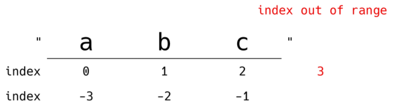
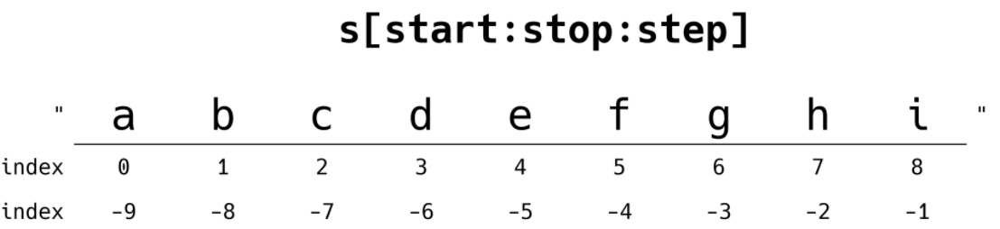

# 데이터 구조 (Data Structures)

> ##### · Algorithms + Data Structures = Programs (Niklaus Wirth, 파스칼 설계자 및 1984년 튜링상 수상자)
>
> ##### · 데이터에 편리하게 접근하고, 변경하기 위해 데이터를 저장하거나 조작하는 법
>
> ##### · 순서가 있는 데이터 구조
>
> > · 문자열(String)  
> > · 리스트(List)
>
> ##### · 순서가 없는 데이터 구조
>
> > · 세트(set)  
> > · 딕셔너리(Dictionary)


## 문자열

> ##### · 문자들의 나열 (sequence of characters)
>
> ##### · 문자열의 특징
>
> > · 변경할 수 없고 (immutable)  
> > · 순서가 있고 (ordered)  
> > · 순회 가능한 (iterable)

##### · Immutable

```python
a = 'my string?'
a[-1] = '!'
```

> TypeError :  'str' object does not support item assignment

##### · Iterable

```python
a = '123'
for char in a:
	print(char)
```

> 1  
> 2  
> 3

### 문자열 인덱스 (Index)

##### · 파이썬에서 문자열은 아래와 같이 접근할 수 있음

> 

### 문자열 자르기 (Slicing)

##### · 파이썬에서 문자열은 아래와 같이 자를 수 있음



> ##### · s[2 : 5]  =>  'cde'
>
> ##### · s[-6 : -2]  =>  'defg'
>
> ##### · s[2 : -4]  =>  'cde'
>
> ##### · s[2 : 5 : 2]  =>  'ce'
>
> ##### · s[-6 : -1 : 3]  =>  'dg'
>
> ##### · s[2 : 5 : -1]  =>  ''
>
> ##### · s[5 : 2 : -1]  =>  'fed'
>
> ##### · s[ : 3]  =>  'abc'
>
> ##### · s[5 : ]  =>  'fghi'
>
> ##### · s[ : : ]  =>  'abcdefghi'
>
> ​	· s[0 : len(s) : 1]과 동일
>
> ##### · s[ : : -1]  =>  'ihgfedcba'
>
> ​	· s[-1 : -(len(s)+1) : -1]과 동일

### 문자열

##### · 문자들의 나열 (sequence of characters)

##### · 문자열의 특징

> · 변경할 수 없고 (immutable)  
> · 순서가 있고 (ordered)  
> · 순회 가능한 (iterable)

### 문자열 조회/탐색

##### · .find(x)

​	· x의 첫 번째 위치를 반환. 없으면 -1을 반환함

```python
'apple'.find('p')
```

> 1

```python
'apple'.find('k')
```

> -1

##### · .index(x)

​	· x의 첫 번째 위치를 반환. 없으면 오류 발생

```python
'apple'.index('p')
```

> 1

```python
'apple'.index('k')
```

> ValueError :  substring not found

### 문자열 변경

##### · .replace(old, new[ ,count])

​	· 바꿀 대상 글자를 새로운 글자로 바꿔서 반환  
​	· count를 지정하면, 해당 개수만큼만 시행

```python
'coone'.replace('o', 'a')
```

> 'caane'

```python
'wooooowoo'.replace('o', '!', 2)
```

> 'w!!ooowoo'

##### · .strip([chars])

​	· 특정한 문자들을 지정하면 양쪽을 제거하거나(strip), 왼쪽을 제거하거나(lstrip), 오른쪽을 제거(rstrip)

##### · 문자열을 지정하지 않으면 공백을 제거함

```python
'	와우!\n'.strip()
```

> '와우!'

```python
'	와우!\n'.lstrip()
```

> '와우!\n'

```python
'	와우!\n'.rstrip()
```

> '		와우!'

```python
'안녕하세요????'.rstrip('?')
```

> '안녕하세요'

##### · .split([chars])

​	· 문자열을 특정한 단위로 나눠 리스트로 반환

```python
'a,b,c'.split('_')
```

> ['a,b,c']

```python
'a b c'.split()
```

> ['a',  'b',  'c']

##### · 'separator' .join([iterable])

​	· 반복가능한(iterable) 컨테이너 요소들을 separator(구분자)로 합쳐 문자열 반환

```python
'!'.join('hello')
```

> ' h ! e ! l ! l ! o'

```python
' '.join(['3', '5'])
```

> '3  5'
