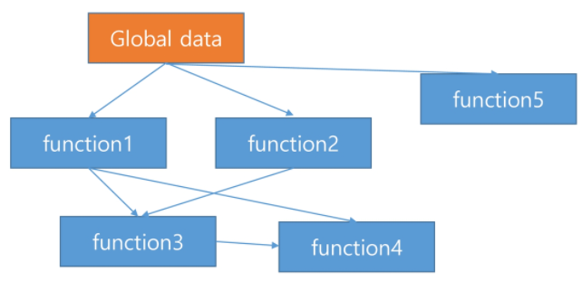
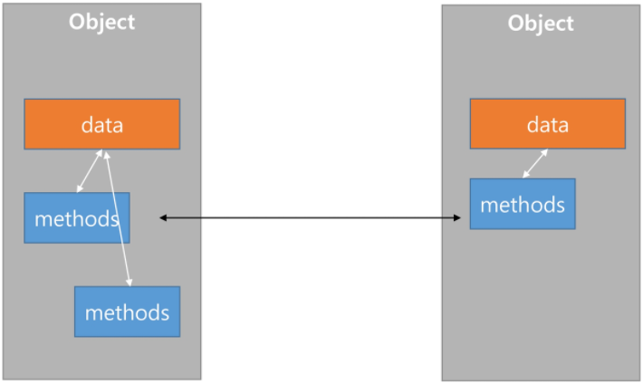
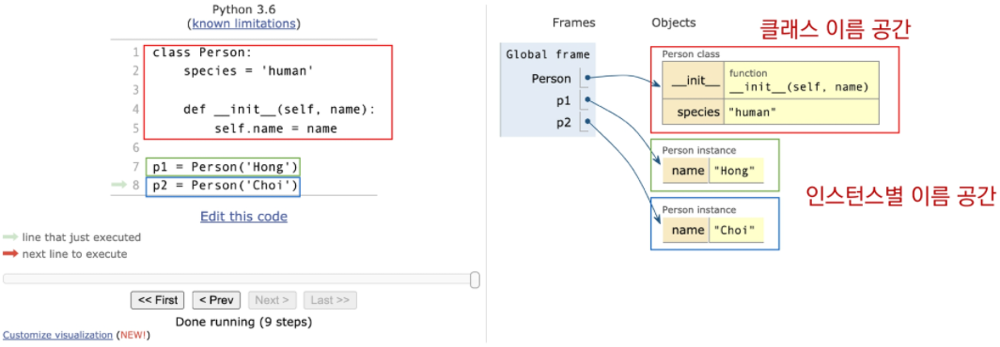
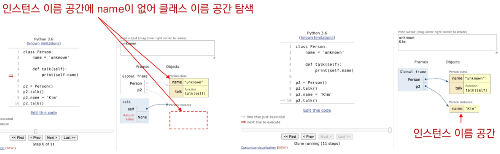

# OOP (Object-Oriented Programming)

## 객체 (Object)

##### · 클래스에서 정의한 것을 토대로 메모리에 할당된 것

##### · 프로그램에서 사용되는 데이터 또는 식별자에 의해 참조되는 공간

> 변수, 자료 구조, 함수 또는 메소드가 될 수 있음

#### · 객체(object)는 특정 타입의 인스턴스(instance) 이다.

> 123, 900, 5는 모두 int의 인스턴스  
> 'hello', 'bye'는 모두 string의 인스턴스  
> [232, 89, 1], []은 모두 list의 인스턴스

#### · 객체(object)의 특징

  · 타입(type) : 어떤 연산자(operator)와 조작(method)이 가능한가?  
  · 속성(attribute) : 어떤 상태(데이터)를 가지는가?  
  · 조작법(method) : 어떤 행위(함수)를 할 수 있는가?

### is 연산자

##### · 객체의 아이덴티티를 검사하는 연산자

```python
type(10)
```

> int

```python
type(10) is bool
```

> False

```python
type(10) is object
```

> False

### == & is

##### · ==

​	· 동등한(equal)  
​	· 변수가 참조하는 객체가 동등한(내용이 같은) 경우 True  
​	· 두 객체가 같아 보이지만 실제로 동일한 대상을 가리키고 있다고 확인해 준 것은 아님

##### · is

​	· 동일한(identical)  
​	· 두 변수가 동일한 객체를 가리키는 경우 True

### isinstance 함수

##### · isinstance(object, classinfo)

  · classinfo의 instance거나 subclass*인 경우 True

```python
isinstance(10, int)
```

> True

```python
isinstance(10, object)
```

> True

  · classinfo가 tuple인 경우(type으로 구성된) 하나라도 일치하면 True

```python
isinstance(0, (bool, int, complex))
```

> True

  · classinfo가 type이거나 type으로 구성되지 않은 경우 Type Error

```python
isinstance(0, (bool, 'hi', complex))
```

> TypeError: isinstance() arg 2 must be a type or tuple of types

### 객체 - 속성(attribute)

##### · \<object>.\<attribute>

##### · 속성은 객체의 상태/데이터

```python
print((3 + 4j).real)
print((3 + 4j).imag)
```

> 3.0  
> 4.0

### 객체 - 메서드(method)

##### · \<object>.\<method>()

##### · 메서드는 특정 객체에 적용될 수 있는 행위를 뜻하며, 일반적으로 클래스에 정의된 함수

```python
[1, 2, 3].pop()
```

> 3

```python
'hello!'.capitalize()
```

> 'Hello!'

```python
{'a': 'apple'}.items()
```

> dict_items([('a', 'apple')])


## 객체지향 프로그래밍 (OOP)

##### · 객체 지향 프로그래밍(OOP)은 컴퓨터 프로그래밍의 패러다임의 하나

>  컴퓨터 프로그램을 명령어의 목록으로 보는 시각에서 벗어나 여러 개의 독립된 단위, 즉 "객체"들의 모임으로 파악하고자 하는 것

### 절차지향 프로그래밍



  →  데이터와 함수로 인한 변화

### 객체지향 프로그래밍



  →  데이터와 기능(메서드) 분리, 추상화된 구조(인터페이스)

##### · 현실 세계를 프로그램 설계에 반영 (추상화)

```python
class Person:

	def __init__(self, name, gender):
		self.name = name
		self.gender = gender
	
	def greeting(self):
		print(f'안녕하세요, {self.name}입니다.')
```

```python
jieun = Person('아이유', '여')
jieun.greeting()
```

> 안녕하세요, 아이유입니다.

##### · 사각형 넓이를 구하는 코드 (절차지향과 객체지향 코드 비교)

```python
# 절차지향 프로그래밍 1
a = 10
b = 30
square1_area = a * b
square1_circumference = 2 * (a + b)
```

```python
# 절차지향 프로그래밍 2
def area(x, y):
	return x * y
	
def circumference(x, y):
	return 2 * (x + y)
	
a = 10
b = 30
square1_area = area(a, b)
square1_circumference = circumference(a, b)
```

```python
# 객체지향 프로그래밍
class Rectangle:  # 클래스(class) - 사각형
	def __init__(self, x, y):
		self.x = x  # 속성(attribute)
		self.y = y
	
	def area(self):
		return self.x * self.y
	
	def circumference(self):
		return 2 * (self.x + self.y)
		
r1 = Rectangle(10, 30)  # 인스턴스(instance) 생성
r1.area()  # 메서드(method) - 사각형의 행동
r1.circumference()
```

### 클래스(class)와 인스턴스(instance) 개요

```python
# 클래스 정의
class MyClass:
	pass
	
# 인스턴스 생성
my_instance = MyClass()

# 메서드 호출
my_instance.my_method()

# 속성
my_instance.my_attribute
```

##### · 클래스를 정의하고, 인스턴스들을 만들어 활용

  · 클래스 : 객체들의 분류 (class)

```python
class Person:
	pass
	
type(Person)
```

> type

  · 인스턴스 : 하나하나의 실체/예 (instance)

```python
person1 = Person()
isinstance(person1, Person)
```

> True

```python
type(person1)
```

> \_\_main\_\_.Person

### 속성

##### · 특정 데이터 타입/클래스의 객체들이 가지게 될 상태/데이터를 의미

```python
class Person:

	def __init__(self, name):
		self.name = name
```

```python
person1 = Person('지민')
person1.name
```

> '지민'

### 메서드

##### · 특정 데이터 타입/클래스의 객체에 공통적으로 적용 가능한 행위(함수)

```python
class Person:

	def talk(self):
		print('안녕')
		
	def eat(self, food):
		print(f'{food}를 냠냠')
```

```python
person1 = Person()
person1.talk()
```

> 안녕

```python
person1.eat('피자')
person1.eat('치킨')
```

> 피자를 냠냠  
> 치킨를 냠냠

### self

##### · 인스턴스 자기자신

##### · 파이썬에서 인스턴스 메서드는 호출 시 첫번째 인자로 인스턴스 자신이 전달되게 설계

  · 매개변수 이름으로 self를 첫번째 인자로 정의

### 생성자(constructor)

##### · 인스턴스 객체가 생성될 때 호출되는 메서드

```python
class Person:

	def __init__(self):
		print('인스턴스가 생성되었습니다.')
```

```python
person1 = Person()
```

> 인스턴스가 생성되었습니다.

```python
class Person:

	def __init__(self, name):
		print(f'인스턴스가 생성되었습니다. {name}')
```

```python
person1 = Person('지민')
```

> 인스턴스가 생성되었습니다.  지민

### 소멸자(destructor)

##### · 인스턴스 객체가 소멸(파괴)되기 직전에 호출되는 메서드

```python
class Person:

	def __del__(self):
		print('인스턴스가 사라졌습니다.')
```

```python
person1 = Person()
del person1
```

> 인스턴스가 사라졌습니다.

### 매직 메서드

##### · Double underscore(__)가 있는 메서드는 특수한 동작을 위해 만들어진 메서드로, 스페셜 메서드 혹은 매직 메서드라고 불림

##### · 예시

```python
· __str__(self), __len(self)__, __repr__(self)
· __lt__(self, other), __le__(self, other), __eq__(self, other)
· __gt__(self, other), __ge__(self, other), __ne__(self, other)
```

### 매직 메서드 예시

##### · 객체의 특수 조작 행위를 지정 (함수, 연산자 등)

  · \_\_str\_\_ : 해당 객체의 출력 형태를 지정  
  · \_\_gt\_\_ : 부등호 연산자 (>, greater than)

```python
class Circle:

	def __init__(self, r):
		self.r = r
		
	def area(self):
		return 3.14 * self.r * self.r
		
	def __str__(self):
		return f'[원] radius: {self.r}'
		
	def __gt__(self, other):
		return self.r > other.r
```

```python
c1 = Circle(10)
c2 = Circle(1)

print(c1)
print(c1 > c2)
```

> [원]  radius:  10  
> True


## 클래스와 인스턴스

### [변수] 인스턴스 변수

##### · 인스턴스의 속성(attribute)

##### · 인스턴스 마다 완전히 독립적이므로 값을 수정하면 오로지 해당 객체에만 영향을 미침

##### · 각 인스턴스들의 고유한 변수

  · 메서드에서 self.\<name>으로 정의  
  · 인스턴스가 생성된 이후 \<instance>.\<name>으로 접근 및 할당

```python
class Person:

	def __init__(self, name):
		self.name = name  # 인스턴스 변수 정의
```

```python
john = Person('john')
print(john.name)  # 인스턴스 변수 접근
```

> john

```python
john.name = 'John Kim'  # 인스턴스 변수 할당
print(john.name)
```

> John Kim

### [변수] 클래스 변수

##### · 클래스 속성(attribute)

##### · 같은 클래스에서 생성된 모든 객체는 동일한 클래스 변수를 공유

##### · 클래스 선언 내부에서 정의

##### · \<classname>.\<name>으로 접근 및 할당

```python
class Circle:
	pi = 3.14  # 클래스 변수 정의
```

```python
c1 = Circle()
c2 = Circle()

print(Circle.pi)
print(c1.pi)
print(c2.pi)
```

> 3.14  
> 3.14  
> 3.14

### [변수] 클래스 변수와 인스턴스 변수의 함정

##### · 새 Cat 인스턴스를 만들고 각 인스턴스는 name이라는 인스턴스 변수를 얻음

```python
class Cat:
	num_tails = 1				# 클래스 변수
	
	def __init__(self, name):
		self.name = name		# 인스턴스 변수
```

```python
alice = Cat('alice')
james = Cat('james')
print(alice.name)
print(james.name)
```

> alice  
> james

##### · 각 Cat 인스턴스 또는 클래스 자체에서 직접 클래스 변수(num_tails)에 접근 가능

```python
print(alice.num_tails)
print(james.num_tails)
print(Cat.num_tails)
```

> 1  
> 1  
> 1

##### · 그러나 클래스를 통해 인스턴스 변수에 접근할 수 없음

##### · 인스턴스 변수는 각 객체 인스턴스에 특정되고 \_\_init\_\_ 생성자가 실행될 때 만들어짐

​	· 클래스 자체에는 존재하지 않음

```python
print(Cat.name)
```

> AttributeError:  type  object  'Cat'  has  no  attribute  'name'

##### · 클래스 변수를 수정하고 각 인스턴스가 클래스 변수에 접근

```python
Cat.num_tails = 2
```

```python
print(alice.num_tails)
print(james.num_tails)
```

> 2  
> 2

##### · 인스턴스로 클래스 변수를 다시 변경

```python
Cat.num_tails = 1
```

```python
james.num_tails = 2
```

```python
print(alice.num_tails)
print(james.num_tails)
print(Cat.num_tails)
```

> 1  
> 2  
> 1

  →  인스턴스를 통해 클래스 변수를 수정하려고 시도하는 것은 버그나 원치 않는 동작을 유발할 수 있음

### 인스턴스와 클래스 간의 이름 공간 (namespace)

##### · 클래스를 정의하면, 클래스와 해당하는 이름 공간 생성

##### · 인스턴스를 만들면, 인스턴스 객체가 생성되고 이름 공간 생성



##### · 인스턴스에서 특정 속성에 접근하면, 인스턴스-클래스 순으로 탐색

```python
class Person:
	name = 'unknown'
	
	def talk(self):
		print(self.name)
```

```python
p1 = Person()
p1.talk()
p1.name = 'Kim'
p2.talk()
```

> unknown  
> Kim

```python
print(Person.name)
print(p1.name)
```

> unknown  
> Kim



### [메서드] 인스턴스 메서드

##### · 인스턴스가 사용할 메서드

##### · 클래스 내부에 정의되는 메서드의 기본

##### · 호출 시, 첫번째 인자로 인스턴스 자기자신(self)이 전달됨

##### · 클래스 자체에 접근할 수 있음 (인스턴스 메서드가 클래스 상태를 수정할 수 있음)

```python
class MyClass:
	def instance_method(self, arg1, ...):
	
my_instance = MyClass()
my_instance.instance_method(...)
```

##### · 클래스 자체에서 인스턴스 메서드는 호출할 수 없음 (self 인자를 채울 수 있는 방법이 없음)

```python
MyClass.instance_method()
```

> TypeError:  method()  missing  1  required  positional  argument:  'self'

### [메서드] 클래스 메서드

##### · 클래스가 사용할 메서드

##### · @classmethod 데코레이터를 사용하여 정의

##### · 호출 시, 첫번째 인자로 클래스(cls)가 전달됨

##### · cls 인자에만 접근할 수 있기 때문에 객체 인스턴스 상태를 수정할 수는 없음

```python
class MyClass:

	@classmethod
	def class_method(cls, arg1, ...):
	
MyClass.class_method(...)
```

### [메서드] 스태틱 메서드

##### · 클래스가 사용할 메서드 (일반 함수로 동작하지만 클래스의 이름 공간에 귀속 됨)

##### · @staticmethod 데코레이터를 사용하여 정의

##### · 호출 시, 어떠한 인자도 전달되지 않음 (인스턴스, 클래스 정보에 접근/수정 불가)

##### · 임의 개수의 매개 변수는 받을 수 있음 (self나 친 매개 변수만 불가능)

```python
class MyClass:

	@staticmethod
	def class_method(arg1, ...):
	
MyClass.static_method(...)
```

### 메서드 정리

```python
class Korean:
	nation = 'Republic of Korea'
	code = 'KR'
	
	def __init__(self, name, age):
		self.name = name
		self.age = age
		
	def talk(self):
		return f'안녕하세요. {self.name}입니다.'
		
	@classmethod
	def info(cls):
		return (cls.nation, cls.code)
		
	@staticmethod
	def anthem():
		return '동해물과 백두산이 마르고 닳도록...'
```

```python
# 인스턴스 메서드
kim = Korean('김철수', 100)  # 메서드 내부에서 인스턴스 정보(self)를 활용
kim.talk()  # 인스턴스가 호출하여 활용
```

> '안녕하세요.  김철수입니다.'

```python
# 클래스 메서드
Korean.info()  # 메서드 내부에서 클래스 정보(cls)를 활용, 클래스가 호출하여 활용
```

> ('Republic  of  Korea',  'KR')

```python
# 스태틱 메서드
Korean.anthem()  # 어떠한 객체의 정보도 활용하지 않으며, 클래스가 호출하여 활용
```

> '동해물과 백두산이 마르고 닳도록...'

##### · 메서드는 해당 함수에서 어떤 값을 활용하고 변경하는지에 따라 정의할 것

  · 인스턴스는 모든 메서드를 호출 할 수 있음  
  		· 하지만, 인스턴스의 동작은 반드시 인스턴스 메서드로 정의

```python
kim.info()
```

> ('Republic  of  Korea',  'KR')

```python
kim.anthem()
```

> '동해물과 백두산이 마르고 닳도록...'

##### · 클래스는 클래스 속성 접근 여부에 따라 클래스 메서드나 정적 메서드로 정의

### 객체지향 프로그래밍 정리

##### · 클래스 구현

​	· 클래스 정의  
​	· 데이터 속성 정의 (객체의 정보는 무엇인지)  
​	· 메서드 정의 (객체를 어떻게 사용할 것인지)

##### · 클래스  활용

​	· 해당 객체 타입의 인스턴스 생성 및 조작


## 상속

#### · 클래스는 상속이 가능함

​	· 모든 파이썬 클래스는 object를 상속 받음

#### · 상속을 통해 객체 간의 관계를 구축

#### · 부모 클래스의 속성, 메서드가 자식 클래스에 상속되므로 코드 재사용성이 높아짐

```python
class ChildClass(ParentClass):
	pass
```

### 메서드 재사용

```python
class Person:
	def __init__(self, name, age):
		self.name = name
		self.age = age
		
	def talk(self):
		print(f'반갑습니다. {self.name}입니다.')
		
class Professor(Person):
	def __init__(self, name, age, department):
		self.name = name
		self.age = age
		self.department = department
		
class Student(Person):
	def __init__(self, name, age, gpa):
		self.name = name
		self.age = age
		self.gpa = gpa
```

```python
p1 = Professor('박교수', 49, '컴퓨터공학과')
s1 = Student('김학생', 20, 3.5)
p1.talk()  # 부모 Person 클래스의 talk 메서드를 활용
s1.talk()
```

> 반갑습니다.  박교수입니다.  
> 반갑습니다.  김학생입니다.

### 상속 isinstance

##### · isinstance (object, classinfo)

​	· classinfo의 instance거나 subclass*인 경우 True

```python
class Person:
	pass
	
class Professor(Person):
	pass
	
class Student(Person):
	pass
	
p1 = Professor()
s1 = Student()

print(isinstance(p1, Person))
print(isinstance(p1, Professor))
print(isinstance(p1, Student))
print(isinstance(s1, Person))
print(isinstance(s1, Professor))
print(isinstance(s1, Student))
```

> True  
> True  
> False  
> True  
> False  
> True

### issubclass

##### · issubclass (class, classinfo)

​	· class가 classinfo의 subclass면 True  

```python
print(issubclass(bool, int))
print(issubclass(float, int))
print(issubclass(Professor, Person))
```

> True  
> False  
> True

  	· classinfo는 클래스 객체의 튜플일 수 있으며, classinfo의 모든 항목을 검사  
        (하나라도 해당될 경우 True 반환)

```python
issubclass(Professor, (Person, Student))
```

> True

### super()

##### · 자식클래스에서 부모클래스를 사용하고 싶은 경우

```python
class Person:
	def __init__(self, name, age, number, email):
		self.name = name
		self.age = age
		self.number = number
		self.email = email
		
class Student(Person):
	def __init__(self, name, age, number, email, student_id):
		# Person 클래스
		super().__init__(name, age, number, email)
		self.student_id = student_id
```

### 메서드 오버라이딩 (method overriding)

##### · 상속 받은 메서드를 재정의

​	· 상속받은 클래스에서 같은 이름의 메서드로 덮어씀  
​	· 부모 클래스의 메서드를 실행시키고 싶은 경우 super를 활용

```python
class Person:
	def __init__(self, name):
		self.name = name
		
	def talk(self):
		print(f'반갑습니다. {self.name}입니다.')
		
# 자식 클래스 - Professor
class Professor(Person):
	def talk(self):
		print(f'{self.name}일세.')
		
# 자식 클래스 - Student
class Student(Person):
	def talk(self):
		super().talk()
		print(f'저는 학생입니다.')
```

```python
p1 = Professor('김교수')
p1.talk()
```

> 김교수일세.

```python
s1 = Student('이학생')
s1.talk()
```

> 반갑습니다. 이학생입니다.  
> 저는 학생입니다.

