# Web 1

## 개발환경 설정

### Visual Studio Code

##### · HTML/CSS 코드 작성을 위한 Visual Studio Code 추천 확장 프로그램

> · Open in browser  /  Live Server  
> · Auto rename tag  
> · Highlight Matching Tag

###  크롬 개발자 도구

##### · 웹 브라우저 크롬에서 제공하는 개발과 관련된 다양한 기능을 제공

##### · 주요 기능

> ##### · Elements - DOM 탐색 및 CSS 확인 및 변경
>
> ​	· Styles - 요소에 적용된 CSS 확인  
> ​	· Computed - 스타일이 계산된 최종 결과  
> ​	· Event Listeners - 해당 요소에 적용된 이벤트 (JS)
>
> ##### · Sources, Network, Performance, Application, Security, Audits 등

### 현재의 웹 표준

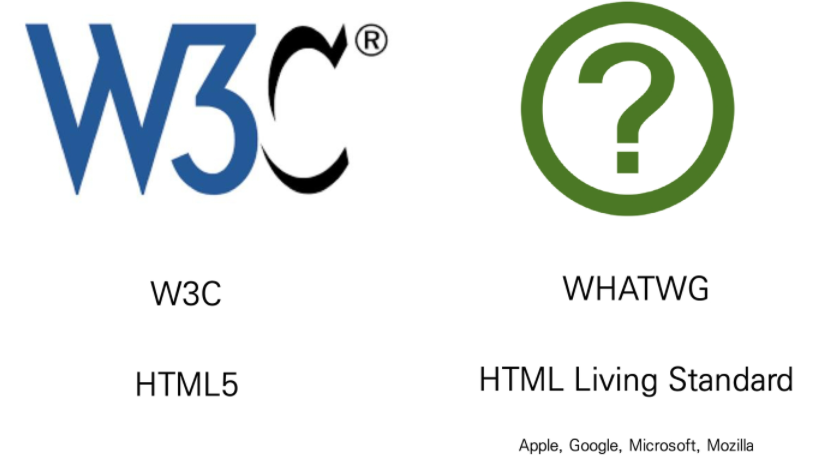


## HTML (Hyper Text Markup Language)

> ##### 웹 페이지를 작성하기 위한(구조를 잡기 위한) 언어.  웹 컨텐츠의 의미와 구조를 정의

### Hyper Text

##### · Hyper : 텍스트 등의 정보가 동일 선상에 있는 것이 아니라 다중으로 연결되어 있는 상태

##### · Hyper Text : 참조(하이퍼링크)를 통해 사용자가 한 문서에서 다른 문서로 즉시 접근할 수 있는 텍스트

### Markup Language

> # \<h1\>HTML\</h1\>
>
> \<p\>HTML이란 Hyper Text Markup Language 의 약자이다.\</p\>
>
>
> ## \<h2\>Hyper Text.\</h2\>
>
> \<p\>Hyper Text란 기존의 선형적인 텍스트가 아닌 비 선형적으로 이루어진 텍스트를 의미하며, 이는 인터넷의 등장과 함께 대두되었다. 기본적으로 Hyper Link를 통해 텍스트를 이동한다.\</p\>
>
> \<p\>본문 : 이러한 Hyper Text는 인간이 기억하는 방식까지 바꾸고 있는데 이를 컬럼비아대 벳시 스패로 교수팀은 구글 효과(Google Effect)라고 이름붙이고, 해당 연구를 '사이언스' 지에 게재하였다.\</p\>
>
>
> ## \<h2\>구글 효과(Google Effect).\</h2\>
>
> \<p\>구글 효과란...\</p\>

##### · 태그 등을 이용하여 문서나 데이터의 구조를 명시하는 언어

##### · 프로그래밍 언어와는 다르게 단순하게 데이터를 표현하기만 한다.

##### · 대표적인 예 : HTML, Markdown


## HTML 기본 구조

### [기본 구조] html 요소

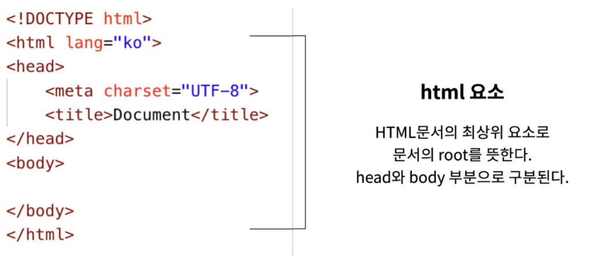

### [기본 구조] head 요소

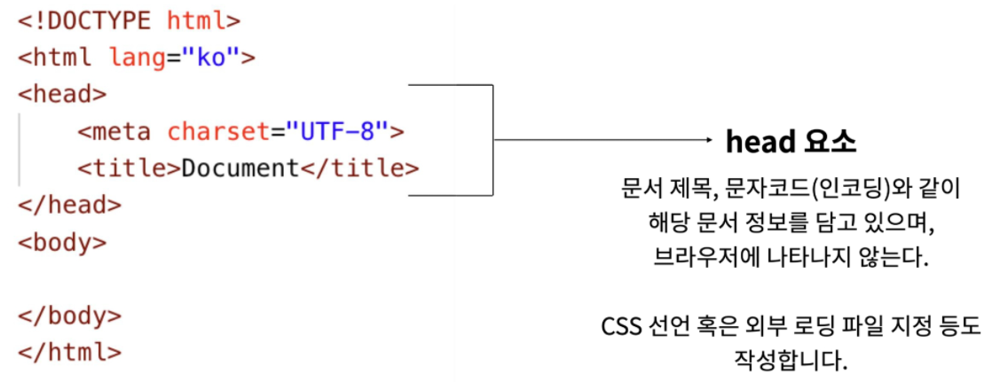

### [기본 구조] body 요소

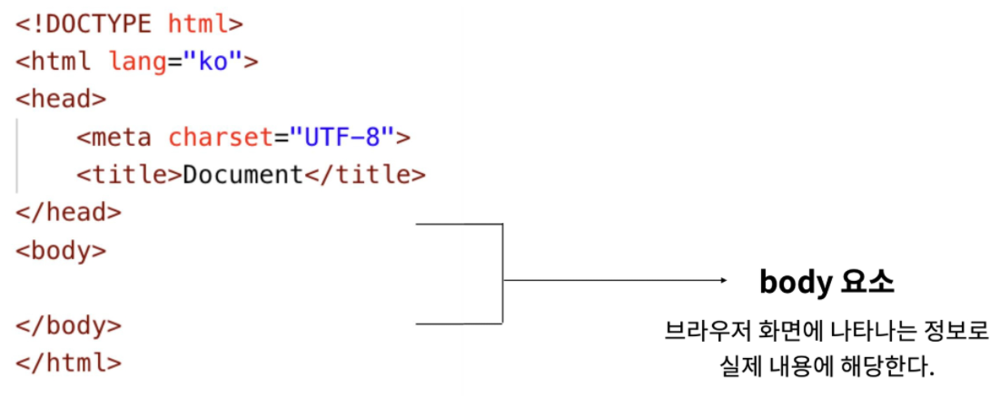

### 메타 데이터를 표현하는 새로운 규약, Open Graph Protocol

##### · HTML 문서의 메타 데이터를 통해 문서의 정보를 전달

##### · 페이스북에서 만들었으며, 메타정보에 해당한느 제목, 설명 등을 쓸 수 있도록 정의


### DOM (Document Object Model) 트리

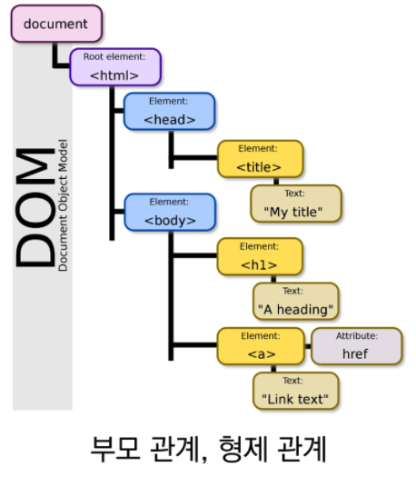

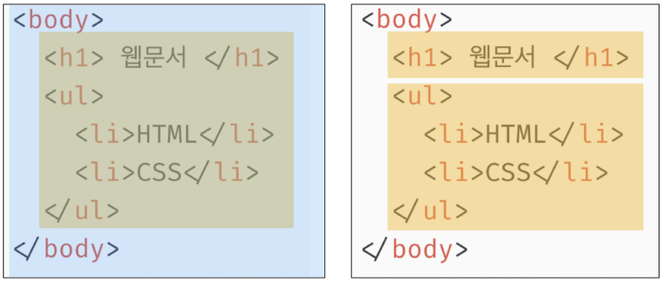

##### · DOM은 문서의 구조화된 표현(Structured Representation)을 제공하며, 프로그래밍 언어가 DOM 구조에 접근할 수 있는 방법을 제공하여 그들이 문서 구조, 스타일 내용 등을 변경 할 수 있게 도움

##### · DOM은 동일한 문서를 표현하고, 저장하고, 조작하는 방법을 제공

##### · Web Page의 객체 지향 표현

### 요소 (element)

```html
<h1>contents</h1>
```

##### · HTML 요소는 시작 태그와 종료 태그 그리고 태그 사이에 위치한 내용으로 구성

​	· 태그 (Element, 요소)는 컨텐츠(내용)를 감싸는 것으로 그 정보의 성격과 의미를 정의

##### · 내용이 없는 태그들

​	· br,  hr,  img,  input,  link,  meta

##### · 요소는 중첩(nested)될 수 있음

​	· 요소의 중첩을 통해 하나의 문서를 구조화  
​	· 여는 태그와 닫는 태그의 쌍을 잘 확인해야함  
​	· 오류를 반환하는 것이 아닌 그냥 레이아웃이 깨진 상태로 출력되기 때문에, 디버깅이 힘들어 질 수 있음

### 속성 (attribute)

```html
<a href="https://google.com"></a>
```

##### · 속성을 통해 태그의 부가적인 정보를 설정할 수 있음

##### · 요소는 속성을 가질 수 있으며, 경로나 크기와 같은 추가적인 정보를 제공

##### · 요소의 시작 태그에 작성하며 보통 이름과 값이 하나의 쌍으로 존재

##### · 태그와 상관없이 사용 가능한 속성(HTML Global Attribute)들도 있음

### HTML Global Attribute

##### · 모든 HTML 요소가 공통으로 사용할 수 있는 속성 (몇몇 요소에는 아무 효과가 없을 수 있음)

> ·  id, class  
> ·  hidden  
> ·  lang  
> ·  style  
> ·  tabindex  
> ·  title

### 시맨틱 태그

##### · HTML5에서 의미론적 요소를 담은 태그의 등장 ~~div~~

##### · 대표적인 태그들은 다음과 같음

> ·  header  :  문서 전체나 섹션의 헤더 (머릿말 부분)  
> ·  nav  :  내비게이션  
> ·  aside  :  사이드에 위치한 공간, 메인 콘텐츠와 관련성이 적은 콘텐츠  
> ·  section  :  문서의 일반적인 구분, 컨텐츠의 그룹을 표현  
> ·  article  :  문서, 페이지, 사이트 안에서 독립적으로 구분되는 영역  
> ·  footer  :  문서 전체나 섹션의 푸터 (마지막 부분)

```html
<header>
  <nav></nav>
</header>
<section>
  <article></arcitle>
  <article></arcitle>
</section>
<footer></footer>
```

##### · 개발자 및 사용자 뿐만 아니라 검색엔진 등에 의미 있는 정보의 그룹을 태그로 표현

##### · 단순히 구역을 나누는 것 뿐만 아니라 '의미'를 가지는 태그들을 활용하기 위한 노력

##### · Non semantic 요소는 div, span 등이 있으며 h1, table 태그들도 시맨틱 태그로 볼 수 있음

##### · 요소의 의미가 명확해지기 때문에 코드의 가독성을 높이고 유지보수를 쉽게 함

##### · 검색엔진최적화(SEO)를 위해서 메타태그, 시맨틱 태그 등을 통한 마크업을 효과적으로 할 필요가 있다.

### 시맨틱 웹

##### · 웹 상에 존재하는 수많은 웹 페이지들에 메타데이터를 부여

##### · 기존의 단순한 데이터의 집합이었던 웹페이지를 '의미'와 '관련성'을 가지는 거대한 데이터베이스로 구축하고자 하는 발상


## HTML 문서 구조화

### 인라인 / 블록 요소

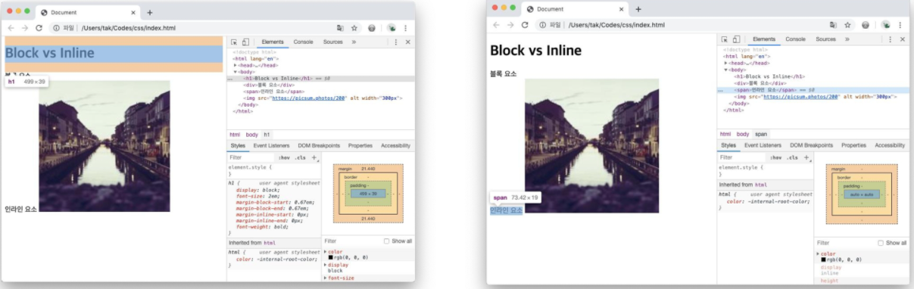

### 그룹 컨텐츠

> ·  \<p\>  
> ·  \<hr\>  
> ·  \<ol\>,  \<ul\>  
> ·  \<pre\>,  \<blockquote\>  
> ·  \<div\>

### 텍스트 관련 요소

> ·  \<a\>  
> ·  \<b\>  vs  \<strong\>  
> ·  \<i\>  vs  \<em\>  
> ·  \<span\>,  \<br\>,  \  
> ·  기타 등등

### table

> ·  \<tr\>,  \<td\>,  \<th\>  
> ·  \<thead\>,  \<tbody\>,  \<tfoot\>  
> ·  \<a\>  
> ·  셀 병합 속성 :  colspan,  rowspan  
> ·  scope 속성  
> ·  \<col\>,  \<colgroup\>

### form

##### · \<form\>은 서버에서 처리될 데이터를 제공하는 역할

##### · \<form\>의 기본 속성

> ·  action  
> ·  method

### input

##### · 다양한 타입을 가지는 입력 데이터 필드

##### · \<lable\> : 서식 입력 요소의 캡션

##### · \<input\> 공통 속성

> ·  name, placeholder  
> ·  required  
> ·  autofocus

##### · \<input\> 요소의 동작은 type에 따라 달라지므로, 각각의 내용 숙지하기

https://developer.mozilla.org/ko/docs/Web/HTML/Element/Input

### 마크업 실습

> 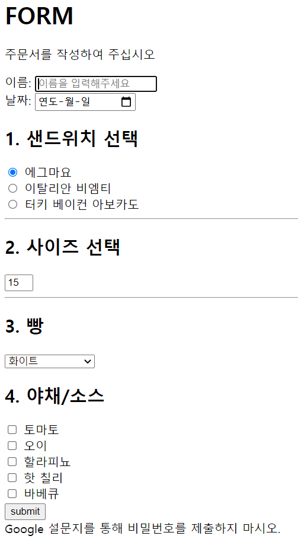

```html
<header>
  <h1>FORM</h1>
</header>
<section>
  <form action="#">
    <!-- 날짜 -->
    <!-- 샌드위치 선택 -->
    <hr>
    <!-- 사이즈 선택 -->
    <hr>
    <!-- 빵 -->
    <!-- 야채/소스 -->
    <input type="submit" value="submit" onclick="alert('주문완료')">
  </form>
  <footer>
    Google 설문지를 통해 비밀번호를 제출하지 마시오.
  </footer>
</section>
```


## CSS (Cascading Style Sheets)

> ##### 스타일, 레이아웃 등을 통해 문서(HTML)를 표시하는 방법을 지정하는 언어

### CSS 구문

```css
h1 {
  color: blue;
  font-size: 15px;
}
```

##### · CSS 구문은 선택자와 함께 열림

##### · 선택자를 통해 스타일을 지정할 HTML 요소를 선택

##### · 중괄호 안에서는 속성과 값, 하나의 쌍으로 이루어진 선언을 진행

##### · 각 쌍은 선택한 요소의 속성, 속성에 부여할 값을 의미

> · 속성 (Property) : 어떤 스타일 기능을 변경할지 결정  
> · 값 (Value) : 어떻게 스타일 기능을 변경할지 결정

### CSS 정의 방법

##### · 인라인 (inline) : 해당 태그에 직접 style 속성을 활용

```html
<body>
  <h1 style="color: blue; font-size: 100px;">Hello</h1>
</body>
```

##### · 내부 참조 (embedding) : head 태그 내 \<style\>에 지정

```html
<head>
  <style>
    h1 {
      color: blue;
      font-size: 100px;
    }
  </style>
</head>
```

> 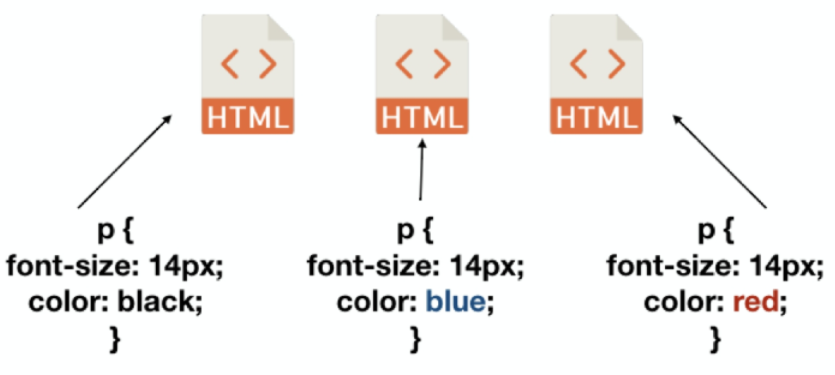

##### · 외부 참조 (link file) : 외부 CSS 파일을 \<head\>내 \<link\>를 통해 불러오기

```html
<head>
  <link rel"stylesheet" href="mystyle.css">
</head>
```

> 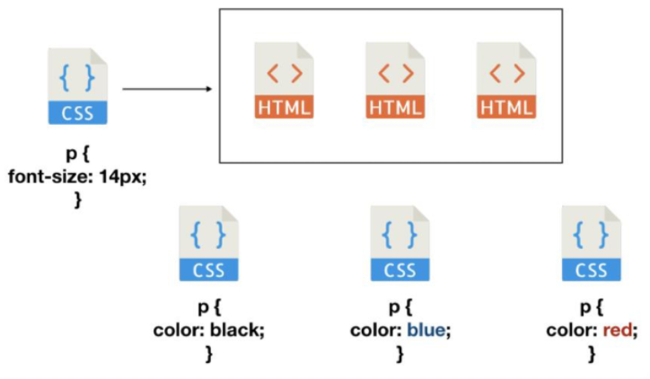


## CSS Selectors

### 선택자 (Selector)

> ##### · HTML 문서에서 특정한 요소를 선택하여 스타일링 하기 위해서는 반드시 선택자라는 개념이 필요
>
> ##### · 기본 선택자
>
> > ·  전체 선택자,  요소 선택자  
> > ·  클래스 선택자,  아이디 선택자,  속성 선택자
>
> ##### · 결합자 (Combinators)
>
> > ·  자손 결합자,  자식 결합자  
> > ·  일반 형제 결합자,  인접 형제 결합자
>
> ##### · 의사 클래스/요소 (pseudo class)
>
> > ·  링크,  동적 의사 클래스  
> > ·  구조적 의사 클래스,  ~~기타 의사 클래스,  의사 엘리먼트,  속성 선택자~~

### CSS 선택자 정리

##### · 요소 선택자

​	· HTML 태그를 직접 선택

##### · 클래스(class) 선택자

​	· 마침표(.)문자로 시작하며, 해당 클래스가 적용된 모든 항목을 선택

##### · 아이디(id) 선택자

​	· # 문자로 시작하며, 해당 아이디가 적용된 모든 항목을 선택  
​	· 일반적으로 하나의 문서에 1번만 사용 (Unique)  
​	· 여러 번 사용해도 동작하지만, 단일 id를 사용하는 것을 권장

### CSS 적용 우선순위 (Cascading order)

##### · CSS 우선순위를 아래와 같이 그룹을 지어볼 수 있음

> 1\. 중요도 (Importance)  # 사용시 주의  
> 	· !important  
> 2\. 우선순위 (Specificity)  
> 	· 인라인  >  id 선택자  >  class 선택자, ~~속성 선택자, pseudo-class~~  >  요소 선택자,  ~~pseudo-element~~  
> 3\. 소스 순서

### CSS 상속

##### · CSS는 상속을 통해 부모 요소의 속성을 ~~모두~~ 자식에게 상속

> ##### · 상속 되는 것 예시
>
> > ·  Text 관련 요소 (font, color, text_align), opacity, visibility 등
>
> ##### · 상속 되지 않는 것 예시
>
> > ·  Box model 관련 요소 (width, height, margin, padding, border, box-sizing, display)  
> > ·  position 관련 요소 (position, top/right/bottom/left, z-index) 등

```html
<body>
  <p>안녕하세요 <span>반갑</span> 습니다.</p>
</body>
```

```css
<style>
  p {
    /* 상속됨 */
    color: red;
    /* 상속 안됨 */
    border: 1px solid black;
  }
  
  span {
    border: 1px solid blue;
  }
</style>
```


## CSS 단위

### 크기 단위

##### · px (픽셀)

> ·  모니터 해상도의 한 화소인 '픽셀'을 기준  
> ·  픽셀의 크기는 변하지 않기 때문에 고정적인 단위

##### · %

> ·  백분율 단위  
> ·  가변적인 레이아웃에서 자주 사용

##### · em

> ·  (바로 위, 부모 요소에 대한) 상속의 영향을 받음  
> ·  배수 단위, 요소에 지정된 사이즈에 상대적인 사이즈를 가짐

##### · rem

> ·  (바로 위, 부모 요소에 대한) 상속의 영향을 받지 않음  
> ·  최상위 요소(html)의 사이즈를 기준으로 배수 단위를 가짐

##### · viewport

> ·  웹 페이지를 방문한 유저에게 바로 보이게 되는 웹 컨텐츠의 영역  
> ·  주로 스마트폰이나 태블릿 디바이스의 화면을 일컫는 용어로 사용됨  
> ·  글자 그대로 디바이스의 viewport를 기준으로 상대적인 사이즈가 결정됨  
> ·  vw, vh, vmin, vmax

```html
<body>
  <ul class="em">
    <li class="em">1.5em</li>
    <li class="rem">1.5rem</li>
    <li>no class</li>
  </ul>
</body>
```

```css
<style>
  .em {
    font-size: 1.5em;
  }
  
  .rem {
    font-size: 1.5rem;
  }
</style>
```

### 색상 단위

##### 1. 색상 키워드

> ·  대소문자를 구분하지 않음  
> ·  red, blue, black 과 같은 특정 색을 직접 글자로 나타냄

##### 2. RGB 색상

> ·  16진수 표기법 혹은 함수형 표기법을 사용해서 특정 색을 표현하는 방식

##### 3. HSL 색상

> ·  색상, 채도, 명도를 통해 특정 색을 표현하는 방식

```css
/* 모두 black을 표시 */
p { color: black; }
p { color: #000; }
p { color: #000000; }
p { color: rgb(0, 0, 0); }
p { color: hsl(120, 100%, 0); }

/* a는 alpha(투명도)가 추가된 것 */
p { color: rgba(0, 0, 0, 0.5); }
p { color: hsla(120, 100%, 0.5); }
```

### CSS 문서 표현

##### · 텍스트

> ·  변형 서체 (\<b\> vs \<strong\>, \<i\> vs \<em\>)  
> ·  자간, 단어 간격, 행간, 들여쓰기  
> ·  기타 꾸미기

##### · 컬러(color), 배경(background-image, background-color)

##### · 목록 꾸미기

##### · 표 꾸미기


## Selectors 심화

### 결합자 (Combinators)

##### · 자손 결합자

​	· selector A 하위의 모든 selector B 요소

```css
div span {
  color: red;
}
```

```html
<div>
  <span>이건 빨강입니다.</span>
  <p>이건 빨강이 아닙니다.</p>
  <p>
    <span>이건 빨강입니다.</span>
  </p>
</div>
```

##### · 자식 결합자

​	· selector A 바로 아래의 selector B 요소

```css
div > span {
  color: red;
}
```

```html
<div>
  <span>이건 빨강입니다.</span>
  <p>이건 빨강이 아닙니다.</p>
  <p>
    <span>이건 빨강이 아닙니다.</span>
  </p>
</div>
```

##### · 일반 형제 결합자

​	· selector A 의 형제 요소 중 뒤에 위치하는 selector B 요소를 모두 선택

```css
p ~ span {
  color: red;
}
```

```html
<span>p태그의 앞에 있기 때문에 이건 빨강이 아닙니다.</span>
<p>여기 문단이 있습니다.</p>
<b>그리고 코드도 있습니다.</b>
<span>p태그와 형제이기 때문에 이건 빨강입니다!</span>
<b>더 많은 코드가 있습니다.</b>
<span>이것도 p태그와 형제이기 때문에 빨강입니다!</span>
```

##### · 인접 형제 결합자

​	· selector A 의 형제 요소 중 바로 뒤에 위치하는 selector B 요소를 선택

```css
p + span {
  color: red;
}
```

```html
<span>p태그의 앞에 있기 때문에 이건 빨강이 아닙니다.</span>
<p>여기 문단이 있습니다.</p>
<span>p태그와 인접한 형제이기 때문에 이건 빨강입니다!</span>
<b>그리고 코드도 있습니다.</b>
<span>p태그와 인접한 형제가 아니기 때문에 이건 빨강이 아닙니다.</span>
```


## CSS Box model

##### · 모든 HTML 요소는 box 형태로 되어있음

##### · 하나의 박스는 네 부분(영역)으로 이루어짐

> ·  content  
> ·  padding  
> ·  border  
> ·  margin

### Box model 구성

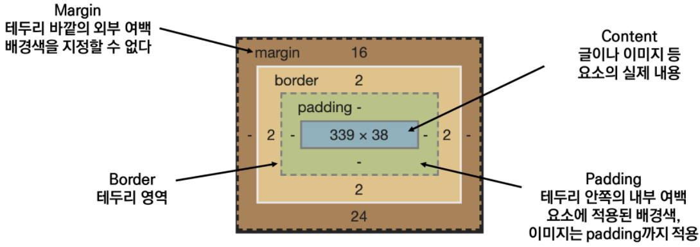

##### · margin

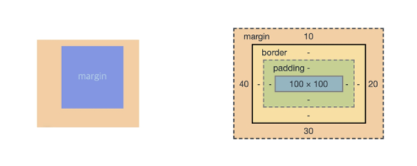

```css
.margin {
  margin-top: 10px;
  margin-right: 20px;
  margin-bottom: 30px;
  margin-left: 40px;
}
```

##### · padding

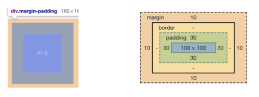

```css
.margin-padding {
  margin: 10px;
  padding: 30px;
}
```

##### · margin/padding - shorthand 표현

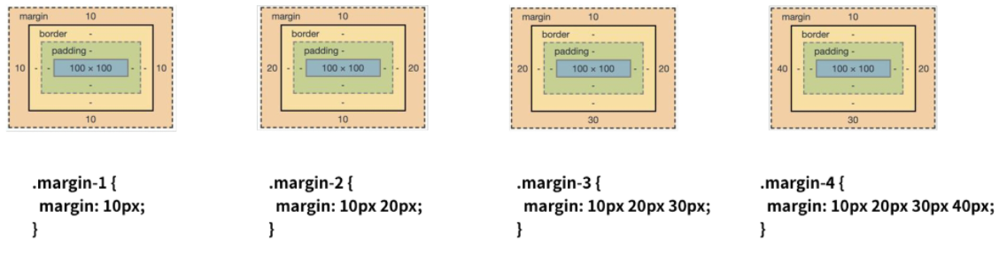

##### · border

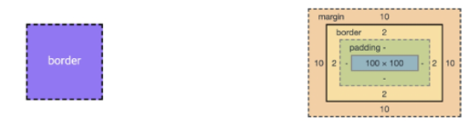

```css
.border {
  border-width: 2px;
  border-style: dashed;
  border-color: black;
}
```

```css
/* border - shorthand */
.border {
  border: 2px dashed black;
}
```

### Box model 실습

```html
<body>
  <div class="box1">div</div>
  <div class="box2">div</div>
</body>
```

```css
<style>
  .box1 {
    width: 500px;
    border-width: 2px;
    border-style: dashed;
    border-color: black;
    padding-left: 50px;
    margin-bottom: 30px;
  }
  
  .box2 {
    width: 500px;
    border: 2px solid black;
    padding: 20px 30px;
    margin: 0 auto;
  }
</style>
```

> 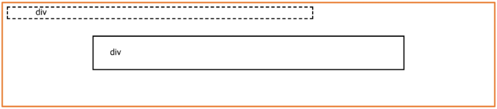

### Box size 실습

```html
<body>
  <div class="box">div</div>
  <div class="box box-sizing">div</div>
</body>
```

```css
<style>
  .box {
    width: 100px;
    margin: 10px auto;
    padding: 20px;
    border: 1px solid black;
    color: white;
    text-align: center;
    background-color: blueviolet;
  }
  
  .box-sizing {
    box-sizing: border-box;
  }
</style>
```

> 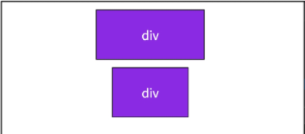
>
> [ box-sizing :  content-box ]
>
> 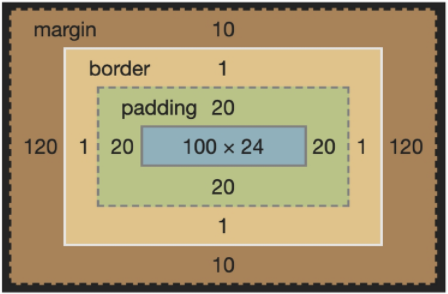
>
> [ box-sizing :  border-box ]
>
> 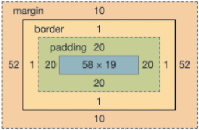

##### · 기본적으로 모든 요소의 box-sizing은 content-box

​	·Padding을 제외한 순수 contents 영역만을 box로 지정

##### · 다만, 우리가 일반적으로 영역을 볼 때는 border까지의 너비를 100px 보는 것을 원함

​	· 그 경우 box-sizing을 border-box로 설정

> 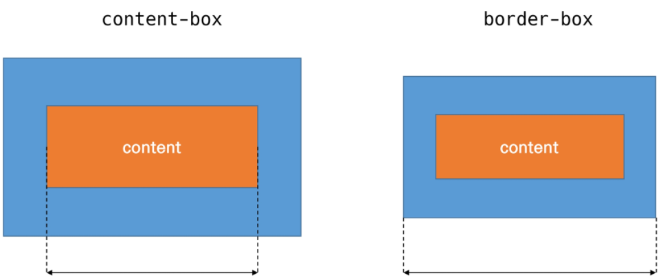

### 마진 상쇄

##### · 인접 형제 요소 간의 각각의 margin이 둘 중에서 큰 마진 값으로 결합(겹쳐지게)되는 현상


## CSS Display

> 모든 요소는 네모(박스모델)이고, 어떻게 보여지는지(display)에 따라 문서에서의 배치가 달라질 수 있음

### display - block, inline

##### · display : block

​	· 줄 바꿈이 일어나는 요소  
​	· 화면 크기 전체의 가로 폭을 차지  
​	· 블록 레벨 요소 안에 인라인 레벨 요소가 들어갈 수 있음

##### · display : inline

​	· 줄 바꿈이 일어나지 않는 행의 일부 요소  
​	· content 너비만큼 가로 폭을 차지  
​	· width, height, margin-top, margin-bottom을 지정할 수 없음  
​	· 상하 여백은 line-height로 지정

### 블록 레벨 요소 / 인라인 레벨 요소

##### · 블록 레벨 요소와 인라인 레벨 요소 구분 (HTML 4.1 까지)

##### · 대표적인 블록 레벨 요소 (https://developer.mozilla.org/ko/docs/Web/HTML/Block-level_elements)

> ·  div  /  ul, ol, li  /  p  /  hr  /  form  등

##### · 대표적인 인라인 레벨 요소 (https://developer.mozilla.org/ko/docs/Web/HTML/Inline_elements)

> ·  span  /  a  /  img  /  input, label  /  b, em, i, strong  등

### Block

> 기본은 너비의 100%
>
> 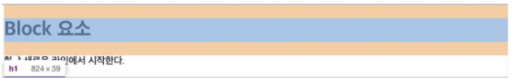
>
> 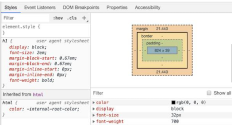

### Inline

> 컨텐츠 영역 만큼만 차지
>
> 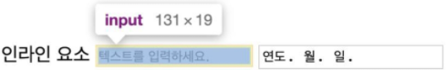
>
> 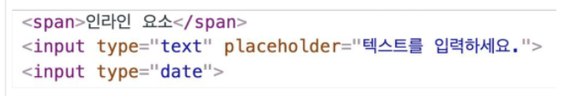
>
> 

### 속성에 따른 수평 정렬

> 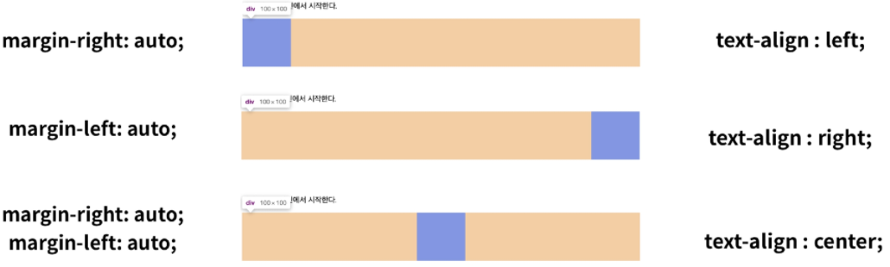

### display - inline-block, none

##### · display : inline-block

​	· block과 inline 레벨 요소의 특징을 모두 가짐  
​	· inline처럼 한 줄에 표시 가능  
​	· block처럼 width, height, margin 속성을 모두 지정할 수 있음

##### · display : none

​	· 해당 요소를 화면에 표시하지 않음 (공간조차 사라짐)  
​	· 이와 비슷한 visibility : hidden은 해당 요소가 공간은 차지하나 화면에 표시만 하지 않음

```html
<body>
  <h1>나는 block입니다</h1>
  <div>block</div>
  <p>나는 <span>인라인</span>속성입니다.</p>
  <hr>
  <h2>display none vs visibility hidden</h2>
  <div>1</div>
  <div class="none">2</div>
  <div class="hidden">3</div>
  <div>4</div>
</body>
```

```css
<style>
  div {
    width: 100px;
    height: 100px;
    border: 2px solid black;
    background-color: crimson;
  }
  
  .none {
    display: none;
  }
  
  .hidden {
    visibility: hidden;
  }
</style>
```

> 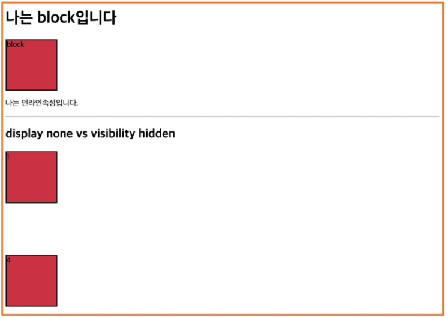


## CSS Position

##### · 문서 상에서 요소를 배치하는 방법을 지정  

##### · static : 모든 태그의 기본 값 (기준 위치)

​	· 일반적인 요소의 배치 순서에 따름 (좌측 상단)  
​	· 부모 요소 내에서 배치될 때는 부모 요소의 위치를 기준으로 배치 됨

##### · 아래는 좌표 프로퍼티(top, bottom, left, right)를 사용하여 이동이 가능 (음수 값도 가능)

> · relative  
> · absolute  
> · fixed

### static

```css
div {
  height: 100px;
  width: 100px;
  background-color: #9775fa;
  color: black;
  line-height: 100px;
  text-align: center;
}
```

> 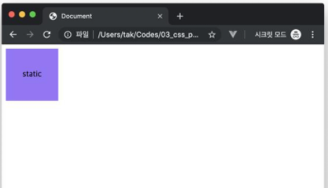

### relative

```css
.relative {
  position: relative;
  top: 100px;
  left: 100px;
}
```

> 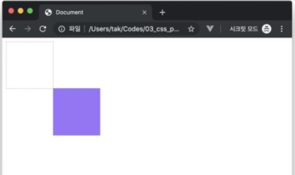

### absolute

```css
.parent {
  position: relative;
}

.absolute-child {
  position: absolute;
  top: 50px;
  left: 50px;
}
```

> 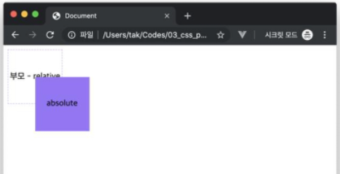

### fixed

```css
.fixed {
  position: fixed;
  bottom: 0;
  right: 0;
}
```

> 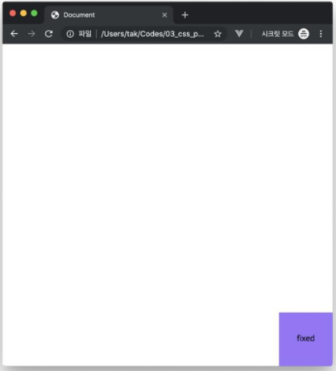

### absolute와 relative 비교

##### · 형에게 top: 100px;을 적용했을 때 absolute와 relative의 차이

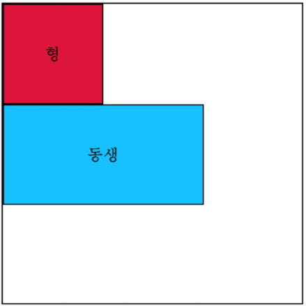

```html
<body>
  <div class="parent">
    <div class="absolute">형</div>
    <div class="sibling">동생</div>
  </div>
  <hr>
  <div class="parent">
    <div class="relative">형</div>
    <div class="sibling">동생</div>
  </div>
</body>
```

```css
<style>
  /* 공통 스타일링 */
  div {
    box-sizing: border-box;
    width: 100px;
    height: 100px;
    border: 1px solid black;
  }
  
  .parent {
    position: relative;
    width: 300px;
    height: 300px;
  }
</style>
```

```css
<style>
  /* 차이점 확인해보기 */
  .absolute {
    position: absolute;
    top: 100px;
    left: 100px;
    background-color: crimson;
  }
  
  .sibling {
    background-color: deepskyblue;
  }
  
  .relative {
    position: relative;
    top: 100px;
    left: 100px;
    background-color: crimson;
  }
</style>
```

> [ absolute ]
>
> 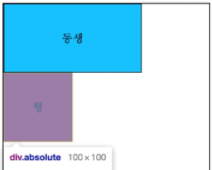
>
> [ relative ]
>
> 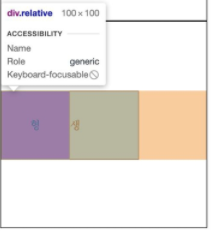

### absolute의 특징

##### · 원래 위치해 있었던 과거 위치에 있던 공간은 더 이상 존재하지 않음

##### · 즉, 다른 모든 것과 별개로 독자적인 곳에 놓임

##### · 페이지의 다른 요소의 위치와 간섭하지 않는 격리된 사용자 인터페이스 기능을 만드는데 활용

##### (팝업 정보 상자, 제어 메뉴, 롤오버 패널, 페이지 어느 곳에서나 끌어서 놓기 할 수 있는 유저 인터페이스 페이지)


## etc.

### 학습 가이드라인

##### · MDN web docs

https://developer.mozilla.org/ko/

### Emmet

##### · HTML & CSS를 작성할 때 보다 빠른 마크업을 위해서 사용되는 오픈소스

##### · 단축키, 약어 등을 사용

##### · 대부분의 텍스트 에디터에서 지원

https://emmet.io/

https://docs.emmet.io/cheat-sheet/

