# Web 2

##### · CSS Layout

> · Display  
> · Position  
> · Float  
> · Flexbox  
> · Grid system

## Float

##### · 본래는 이미지 좌, 우측 주변으로 텍스트를 둘러싸는 레이아웃을 위해 도입

##### · 더 나아가 이미지가 아닌 다른 요소들에도 적용해 웹 사이트의 전체 레이아웃을 만드는데까지 발전

### Float 속성

##### · none : 기본값

##### · left : 요소를 왼쪽으로 띄움

##### · right : 요소를 오른쪽으로 띄움

```html
<!-- 예시 1 -->
<body>
  <div class="box left">float left</div>
  <p>...</p>
</body>
```

```css
.box {
  width: 150px;
  height: 150px;
  border: 1px solid black;
  background-color: crimson;
  color: white;
  margin-right: 30px;
}

.left {
  float: left;
}
```

> 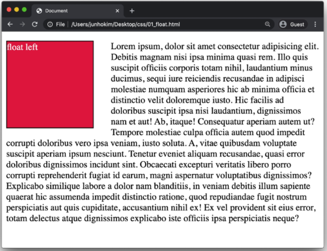

```html
<!-- 예시 2 -->
<body>
  <header>
    <div class="box1">div</div>
  </header>
  <div class="box2">div</div>
</body>
```

```css
<style>
  .box {
    width: 150px;
    height: 150px;
    border: 1px solid black;
    background-color: crimson;
    color: white;
    text-align: center;
    line-height: 150px;
  }
  
  .box2 {
    width: 300px;
    height: 150px;
    border: 1px solid black;
    background-color: blue;
    color: white;
    text-align: center;
    line-height: 150px;
  }
</style>
```

>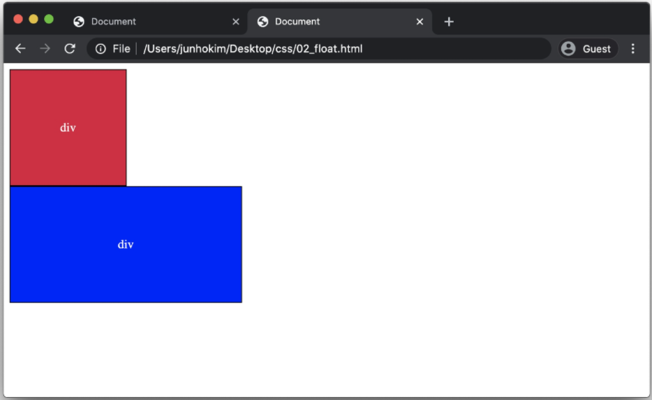

```html
<!-- 예시 3 -->
<body>
  <header>
    <div class="box1 left">div</div>
  </header>
  <div class="box2">div</div>
</body>
```

```css
<style>
  /* style에 float left 추가 */
  .left {
    float: left;
  }
</style>
```

> 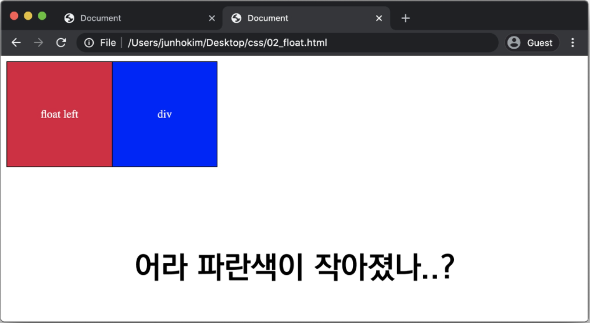

### Float clear

```css
.clearfix::after {
  content: "";
  display: block;
  clear: both;
}
```

##### · ::after : 선택한 요소의 맨 마지막 자식으로 가상 요소를 하나 생성

​	· 보통 content 속성과 함께 짝지어, 요소에 장식용 콘텐츠를 추가할 때 사용  
​	· 기본값은 inline

##### · clear

​	· 선행 floating 요소 다음일 수 있는지 또는 그 아래로 내려가 (해제되어(cleared))야 하는 지를 지정  
​	· clear 속성은 부동 및 비부동 요소 모두에 적용됨

```html
<header class="clearfix">
  <div class="box1 left">float left</div>
</header>
<div class="box2">div</div>
```

```css
<style>
  /* style에 float left 추가 */
  .left {
    float: left;
  }

  .clearfix::after {
    content: "";
    display: block;
    clear: both;
  }
</style>
```

> 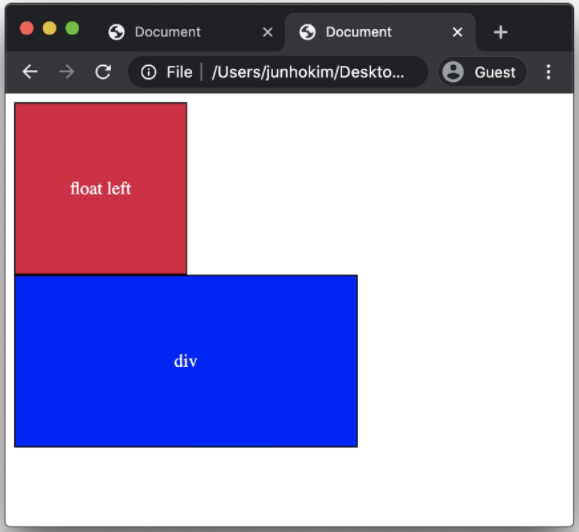

### Float 정리

##### · flexbox 및 그리드 레이아웃과 같은 기술이 나오기 이전에 Float은 열 레이아웃을 만드는데 사용됨

##### · flexbox와 grid의 출현과 함께 결국 원래 텍스트 블록 내에서 float 이미지를 위한 역할로 돌아감

##### (mdn 에서는 더 새롭고 나은 레이아웃 기술이 나와있으므로 레거시 레이아웃 기술로 분류)

##### · 웹에서 여전히 사용되는 경우도 있음 (ex. naver nav bar)


## Flexbox

### CSS Flexible Box Layout

##### · 요소 간 공간 배분과 정렬 기능을 위한 1차원(단방향) 레이아웃

##### · 크게 딱 2가지, 요소와 축 기억하기

##### · 요소

> · Flex Container (부모 요소)  
> · Flex Item (자식 요소)

##### · 축

> · main axis (메인축)  
> · cross axis (교차축)

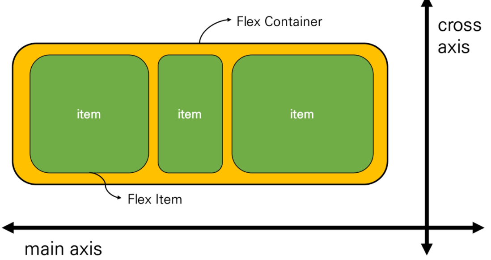

### Flexbox의 구성 요소

##### · Flex Container (부모 요소)

> · flexbox 레이아웃을 형성하는 가장 기본적인 모델  
> · Flex Item들이 놓여있는 영역  
> · display 속성을 flex 혹은 inline-flex로 지정

##### · Flex Item (자식 요소)

> · 컨테이너의 컨텐츠

### Flexbox의 시작

##### · 부모 요소에 display: flex 혹은 inline-flex를 작성하는 것부터 시작

```css
.flex-container {
  display: flex;
}
```

### Flex에 적용하는 속성

##### · 배치 방향 설정

​	· flex-direction

##### · 메인축 방향 정렬

​	· justify-content

##### · 교차축 방향 정렬

​	· align-items,  align-self,  align-content

##### 기타

​	· flex-wrap,  flex-flow,  flex-grow,  order,  ~~flex-shrink,  flex-basis~~

### flex-direction

##### · main-axis 방향만 바뀜

##### · flexbox는 단방향 레이아웃이기 때문

>  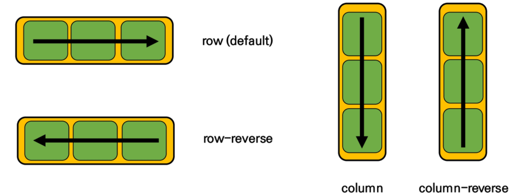

### justify & align

>  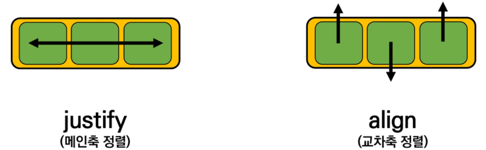

### content & items & self

##### · content : 여러 줄

##### · items : 한 줄

##### · self : flex item 개별 요소

##### · 예시

​	· justify-content : 메인축 기준 여러 줄 정렬  
​	· align-items : 교차축 기준 한 줄 정렬  
​	· align-self : 교차축 기준 선택한 요소 하나 정렬

> ##### · justify-content
>
> ​	· flex-start,  flex-end,  center,  space-between,  space-around,  space-evenly
>
> ##### · align-items
>
> ​	· flex-start,  flex-end,  center,  stretch,  baseline
>
> ##### · align-content
>
> ​	· flex-start,  flex-end,  center,  stretch,  space-between,  space-around
>
> ##### · align-self
>
> ​	· auto,  flex-start,  flex-end,  center,  baseline,  stretch

### Flexbox 사용

```html
<!-- 동일한 구조에서 CSS만 변경 -->

<body>
  <div class="base">
    <h2>Flex</h2>
    <hr>
    <div class="box flex-container">
      <div class="item1">1</div>
      <div class="item2">2</div>
      <div class="item3">3</div>
      <div class="item4">4</div>
      <div class="item5">5</div>
      <div class="item6">6</div>
      <div class="item7">7</div>
      <div class="item8">8</div>
      <div class="item9">9</div>
      <div class="item10">10</div>
      <div class="item11">11</div>
      <div class="item12">12</div>
      <div class="item13">13</div>
      <div class="item14">14</div>
      <div class="item15">15</div>
    </div>
  </div>
</body>
```

##### · CSS 그대로 사용

> 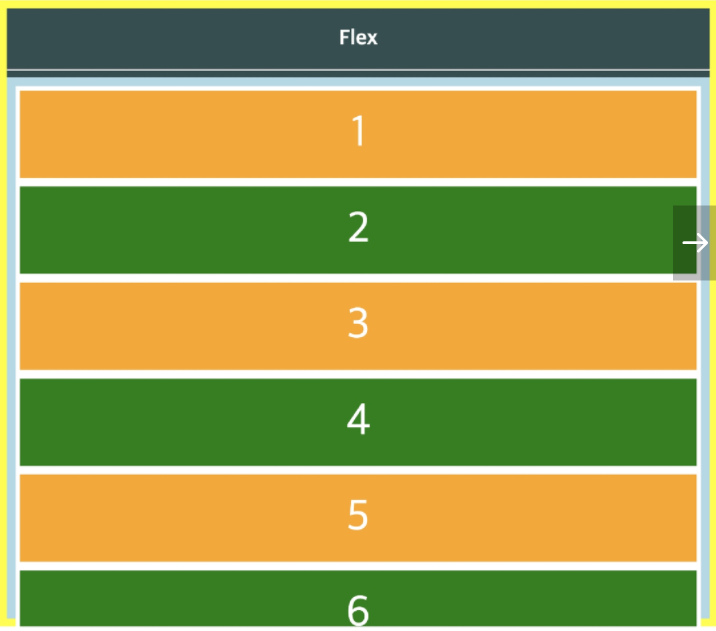

##### · flex 적용

```css
<style>
  .flex-container {
    /* 정렬하고자 하는 부모 요소에 선언 */
    display: flex;
  }
</style>
```

> 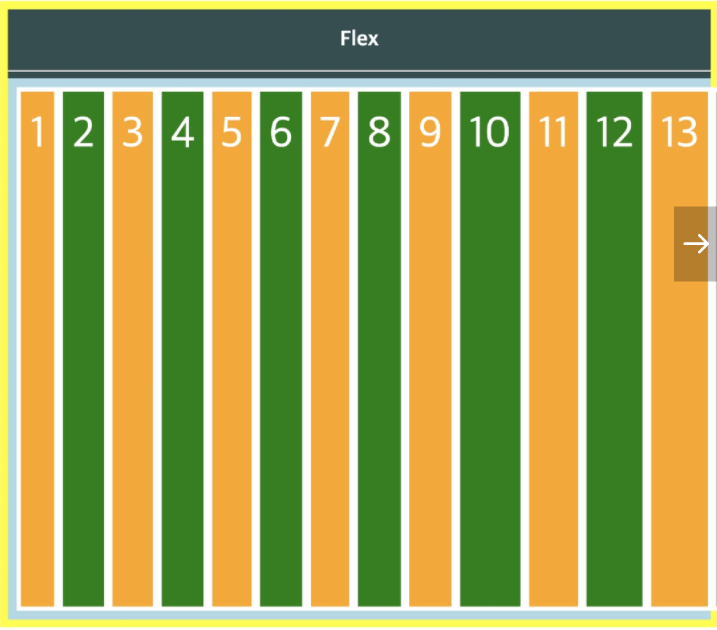

##### · flex-wrap

```css
<style>
  .flex-container {
    display: flex;
  
    /* 요소들이 강제로 한 줄에 배치되게 할 것인지 여부 설정 */
    /* flex-wrap: nowrap; */
    flex-wrap: wrap;
    /* flex-wrap: wrap-reverse */
  }
</style>
```

> 

##### · flex-direction

```css
<style>
  .flex-container {
    display: flex;
  
    /* nowrap 이 기본값 */
    flex-wrap: nowrap;
  
    /* 메인축 방향 설정, 쌓이는 방향 설정 (메인축의 방향만 바뀜) */
    /* flex-direction: row; */
    /* flex-direction: row-reverse; */
    flex-direction: column;
    /* flex-direction: column-reverse; */
  }
</style>
```

> 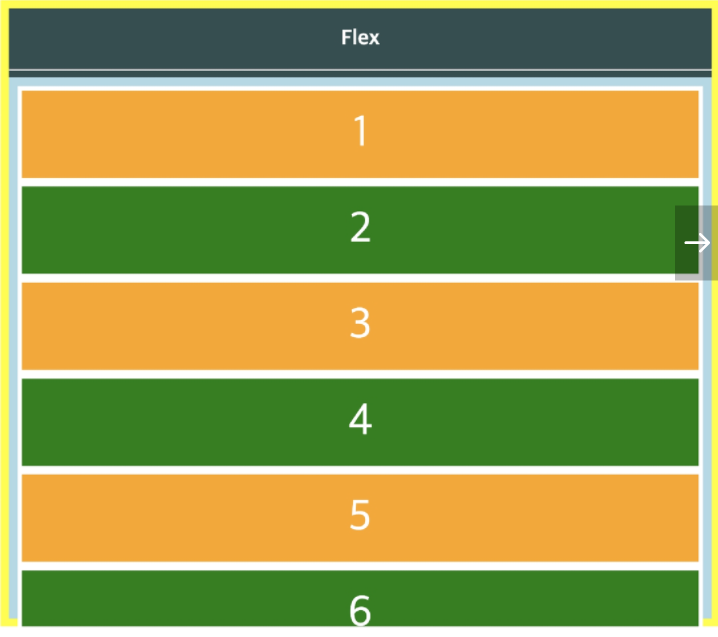

##### · flex-flow

```css
<style>
  .flex-container {
    display: flex;
  
    /* flex-direction과 flex-wrap의 shorthand */
    flex-flow: column wrap;
  }
</style>
```

### Flexbox 정렬 사용

```html
<!-- 동일한 구조에서 CSS만 변경 -->

<body>
  <div class="base">
    <h2>Flex</h2>
    <hr>
    <div class="box flex-container">
      <div class="item1">1</div>
      <div class="item2">2</div>
      <div class="item3">3</div>
    </div>
  </div>
</body>
```

> 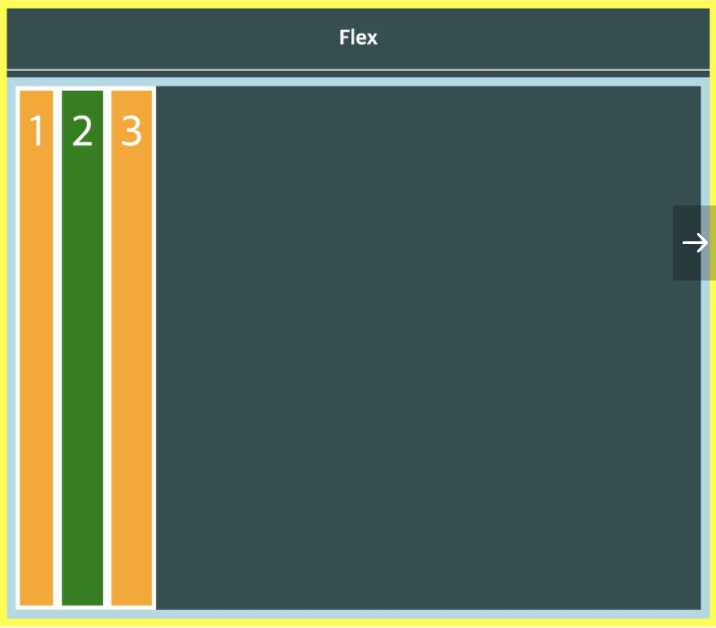

##### · justify-content

```css
<style>
  .flex-container {
    display: flex;
    
    /* row 방향이 기본 값 */
    flex-direction: row;
    
    /* 메인축 정렬 */
    /* justify-content: flex-start; */
    /* justify-content: flex-end; */
    justify-content: center;
    /* justify-content: space-between; */
    /* justify-content: space-around; */
    /* justify-content: space-evenly; */
  }
</style>
```

> 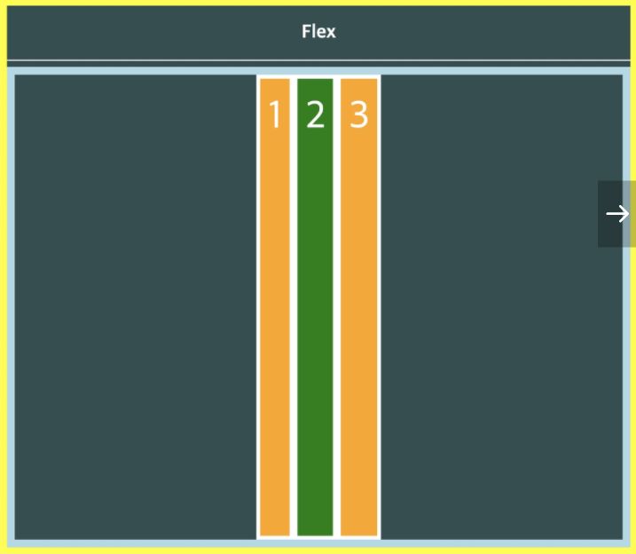

##### · align-items

```css
<style>
  .flex-container {
    display: flex;
    
    flex-direction: row;
    
    /* 교차축 정렬 */
    /* align-items: stretch; */
    /* align-items: flex-start; */
    /* align-items: flex-end; */
    align-items: center;
    /* align-items: baseline; */
  }
</style>
```

> 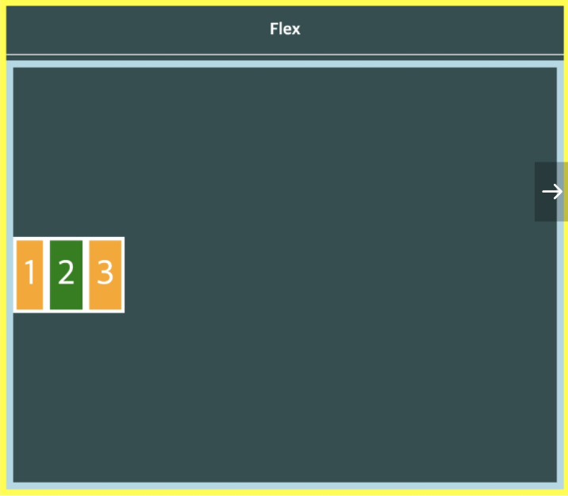

##### · justify-content & align-items

```css
<style>
  .flex-container {
    display: flex;
    justify-content: center;
    align-items: center;
  }
</style>
```

> 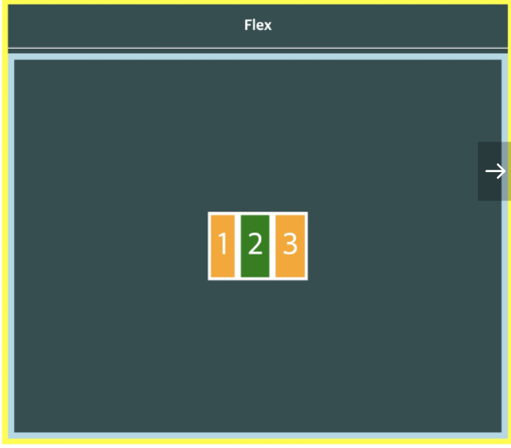

### flex item 개별 스타일링

```css
<style>
  .flex-container {
    display: flex;
  }
  
  .item1 {
    align-self: flex-start;
    order: 0;
    /* 주축에서 남는 공간을 항목들에게 분배 */
    flex-grow: 1;
  }
</style>
```

> 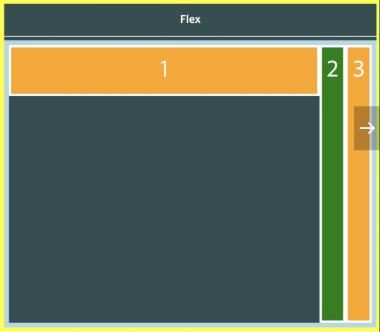
>
> 

```css
<style>
  .flex-container {
    display: flex;
  }
  
  .item1 {
    align-self: flex-start;
    order: 0;
    /* 주축에서 남는 공간을 항목들에게 분배 */
    flex-grow: 1;
  }
  
  .item2 {
    align-self: center:
    order: -1;
    flex-grow: 2;
  }
</style>
```

> 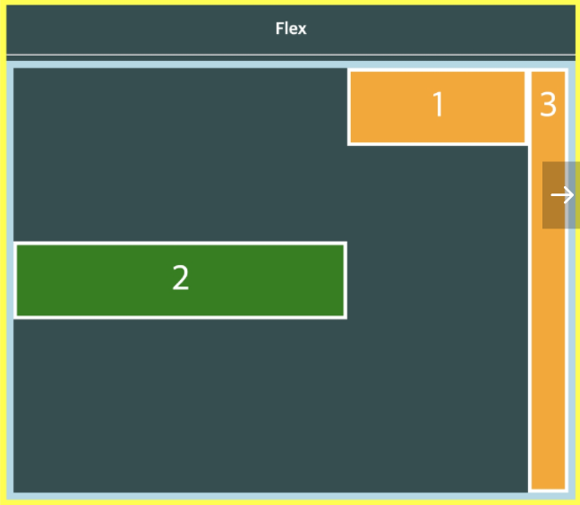

```css
<style>
  .flex-container {
    display: flex;
  }
  
  .item1 {
    align-self: flex-start;
    order: 0;
    /* 주축에서 남는 공간을 항목들에게 분배 */
    flex-grow: 1;
  }
  
  .item2 {
    align-self: center:
    order: -1;
    flex-grow: 2;
  }
  
  .item3 {
    align-self: flex-end;
    order: 1;
    flex-grow: 3;
  }
</style>
```

> 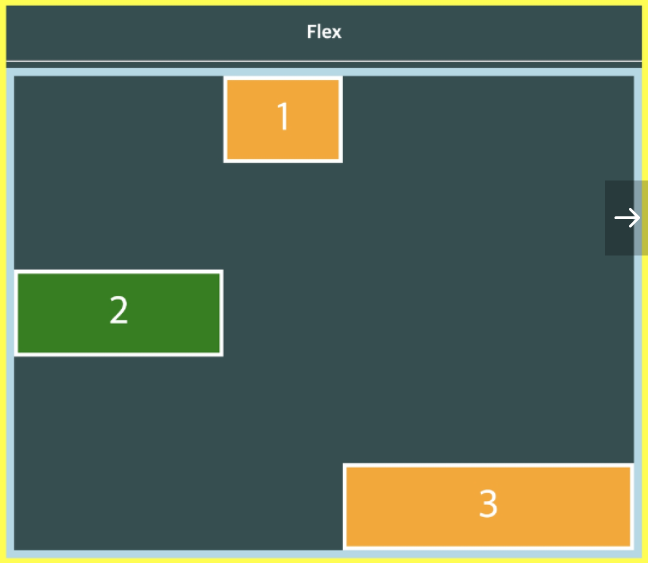

### Can I Use

> 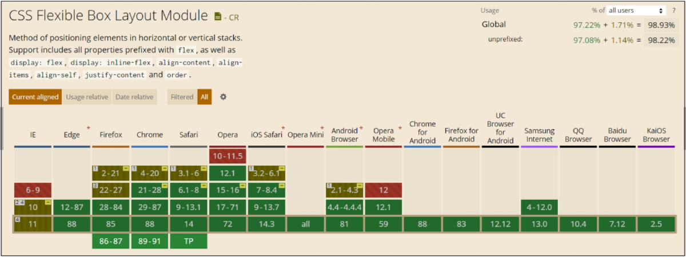

### 정리

##### · display: flex  -  정렬하려는 부모 요소에 작성

> · inline-flex : flex 영역을 블록으로 쓰지 않고 인라인 블록으로 사용

##### · flex-direction  -  item이 쌓이는 방향 결정

> · main-axis 가 변경됨  
> · row (기본 값)  :  주축의 방향이 왼쪽에서 오른쪽  
> · row-reverse  :  주축의 방향이 오른쪽에서 왼쪽  
> · column  :  주축의 방향이 위에서 아래  
> · column-reverse  :  주축의 방향이 아래에서 위

##### · flex-wrap  -  요소들이 강제로 한 줄에 배치되게 할 것인지 여부 설정

> · nowrap (기본 값)  :  모든 아이템을 한 줄에 나타내도록 함  →  자리가 없으면 튀어나옴  
> · wrap  :  넘치면 그 다음 줄로  
> · wrap-reverse  :  넘치면 그 윗줄로 (역순)

##### · flex-flow  -  flex-direction 과 flex-wrap 의 shorthand

> · flex-direction과 flex-wrap에 대한 설정 값을 차례로 작성  
> · ex. flex-flow: row nowrap;

##### · justify-content  -  main 축 정렬

> · flex-start (기본 값)  :  시작 지점부터 차례로 쌓임  
> · flex-end  :  쌓이는 방향이 뒤쪽부터 시작 (순서가 역순이 되는 게 아니라 아이템들이 뒤로 몰리는 형식)  
> · center  :  정중앙  
> · space-between  :  좌우 정렬 (item 들 간의 간격이 동일)  
> · space-around  :  균등 좌우 정렬 (내부 요소 여백은 외곽 여백의 2배)  
> · space-evenly  :  균등 정렬 (내부 요소 여백과 외각 여백 모두 동일)

##### · align-items  -  cross 축 정렬

> · stretch (기본 값)  :  컨테이너를 가득 채움  
> · flex-start  :  위  
> · flex-end  :  아래  
> · center  :  가운데  
> · baseline  :  item 내부의 text에 기준선을 맞춤

##### · align-self  -  개별 item에 적용하는 속성 (정렬 방식은 align-items와 동일, 적용되는 대상이 다름)  

> · auto (기본 값),  flex-start,  flex-end,  center,  baseline  
> · stretch  :  부모 컨테이너에 맞춰 자동으로 늘어남

##### · order

> · 작은 숫자 일수록 앞(우선 쌓이는 방향)으로 이동  
> · 기본 값  :  0

##### · flex-grow

> · 주축에서 남는 공간을 항목들에게 분배하는 방법  
> · 각 아이템의 상대적 비율을 정하는 것은 아님  
> · 기본 값  :  0  
> · 음수 불가능


## Bootstrap

> The world most popular front-end open source

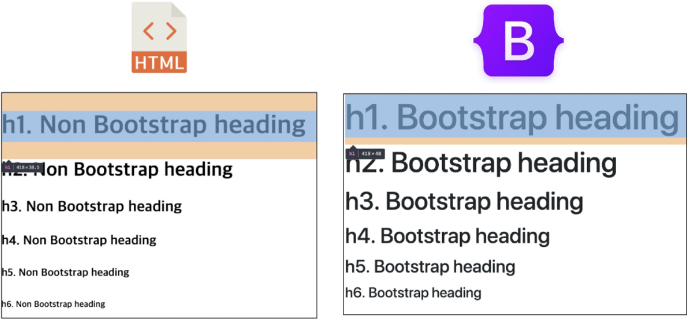

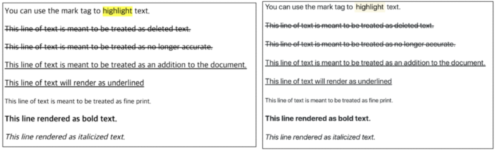

### Bootstrap CSS 다운로드로 사용

https://getbootstrap.kr/docs/5.1/getting-started/download/

> 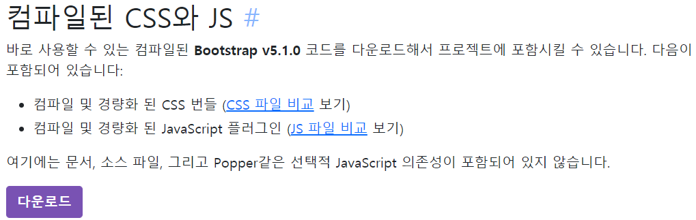

```html
<head>
  <link rel="stylesheet" href="bootstrap.css">
</head>
<body>
  <script src="bootstrap.bundle.js"></script>
</body>
```

### CDN을 활용하여 더 편하게 사용

### Content Delivery(Distribution) Network

##### · 컨텐츠(CSS, JS, Image, Text 등)을 효율적으로 전달하기 위해 여러 노드를 가진 네트워크에 데이터를 제공하는 시스템

> · 개별 end-user의 가까운 서버를 통해 빠르게 전달 가능(지리적 이점)  
> · 외부 서버를 활용함으로써 본인 서버의 부하가 적어짐

> 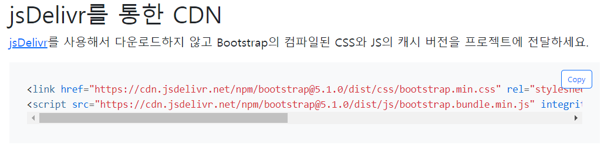

```html
<head>
  <link ...>
</head>
<body>
    <script ...></script>
</body>
```

### spacing

##### · .mt-0 ~ .mt-5  :  margin-top을 rem으로 spacing하는 class

> · rem  :  브라우저 \<html\>의 root 글꼴 크기(16px)에 비례한 크기  
> · ex. 0.25 rem  :  16 * 0.25 = 4px

```css
.mt-1 {
  margin-top: 0.25rem !important;
}
```

| class name | rem  |  px  |
| :--------: | :--: | :--: |
|    m-1     | 0.25 |  4   |
|    m-2     | 0.5  |  8   |
|    m-3     |  1   |  16  |
|    m-4     | 1.5  |  24  |
|    m-5     |  3   |  48  |

##### · .mx-0 ~ .mx-5  :  margin-right, margin-left를 rem으로 spacing하는 class

```css
.mx-0 {
  margin-right: 0 !important;
  margin-left: 0 !important;
}
```

##### · .mx-auto  :  수평 중앙 정렬 (right, left margin을 auto로 spacing하는 class)

```css
.mx-auto {
  margin-right: auto !important;
  margin-left: auto !important;
}
```

##### · .py-0 ~ .py-5  :  padding-top, padding-bottom를 rem으로 spacing하는 class

```css
.py-0 {
  padding-top: 0 !important;
  padding-bottom: 0 !important;
}
```

### spacing 종합

| m      | p        |         |       |             |             |
| ------ | -------- | ------- | ----- | ----------- | ----------- |
| margin | padding  |         |       |             |             |
| **t**  | **b**    | **s**   | **e** | **x**       | **y**       |
| top    | bottom   | left    | right | left, right | top, bottom |
| **0**  | **1**    | **2**   | **3** | **4**       | **5**       |
| 0 rem  | 0.25 rem | 0.5 rem | 1 rem | 1.5 rem     | 3 rem       |
| 0px    | 4px      | 8px     | 16px  | 24px        | 48px        |

### color

> 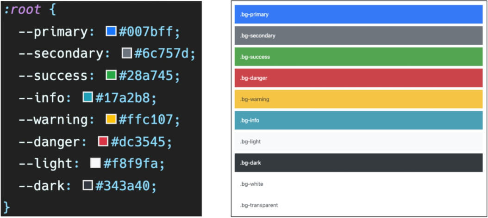

### Bootstrap 실습

```css
<!-- 실습 1 -->

<h2>Spacing</h2>
<div class="box mt-3 ms-5">margin-top 3</div>
<div class="box m-4">margin 4</div>
<div class="box mx-auto">mx auto, 가운데 정렬/div>
<div class="box ms-auto">ms-auto, 오른쪽 정렬</div>
```

> 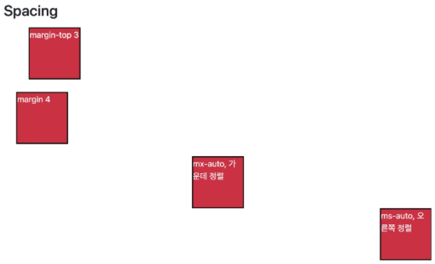

```css
<!-- 실습 2 -->

<h2>Color</h2>
<div class="bg-primary">이건 파랑</div>
<div class="bg-secondary">이건 회색</div>
<div class="bg-danger">이건 빨강</div>
<p class="text-success">이건 초록색 글씨</p>
<p class="text-danger">이건 빨간색 글씨</p>
```

> 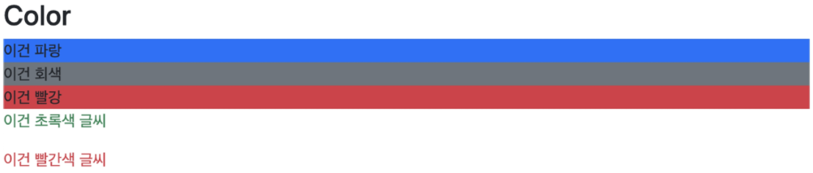

```css
<!-- 실습 3 -->

<h2>Text</h2>
<p class="text-start">Start aligned text on all viewport sizes</p>
<p class="text-center">Center aligned text on all viewport sizes</p>
<p class="text-end">End aligned text on all viewport sizes</p>
<a href="#" class="text-decoration-none">Non-underlined link</a>
<p class="fw-bold">Bold text.</p>
<p class="fw-normal">Normal weight text.</p>
<p class="fw-light">Light weight text.</p>
<p class="fst-italic">Italic text.</p>
```

> 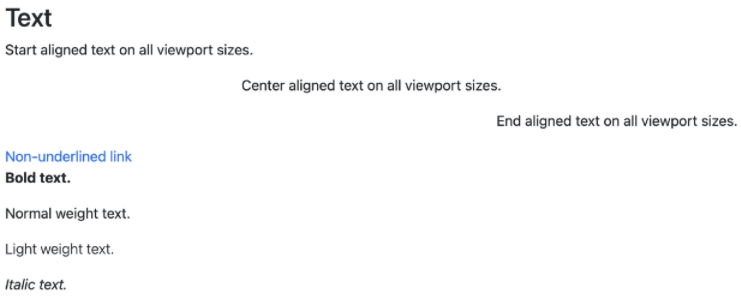

```css
<!-- 실습 4 -->

<h2>Display</h2>
<div class="d-inline p-2 bg-primary text-white">d-inline</div>
<div class="d-inline p-2 bg-dark text-white">d-inline</div>
<span class="d-block p-2 bg-primary text-white">d-block</div>
<span class="d-block p-x bg-dark text-white">d-block</div>
<div class="box bg-warning d-sm-none d-md-blokc">보이나?? 안보이나??</div>
<div class="box bg-success d-md-none d-xl-block">보이나?? 안보이나??</div>
```

> 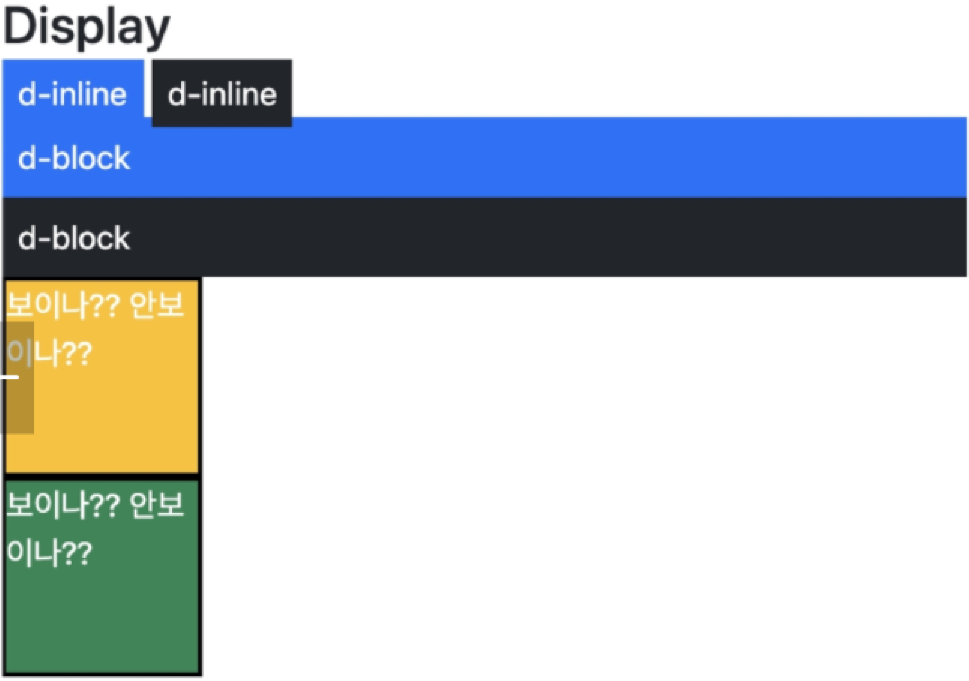

```css
<!-- 실습 5 -->

<h2>Position</h2>
<div class="box fixed-top">fixed-top</div>
<div class="box fixed-bottom">fixed-bottom</div>
```

> 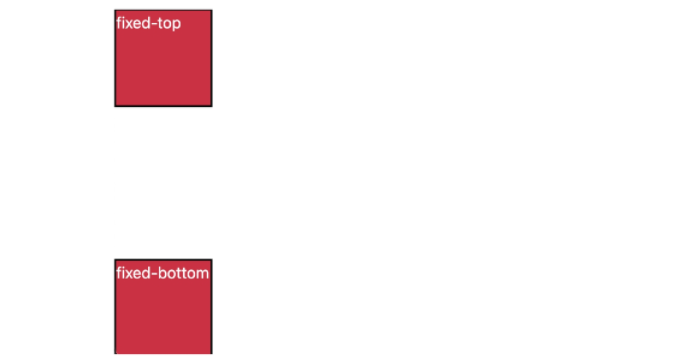

### Responsive Web

> ##### · 같은 컨텐츠를 보는 각기 다른 디바이스
>
> ##### 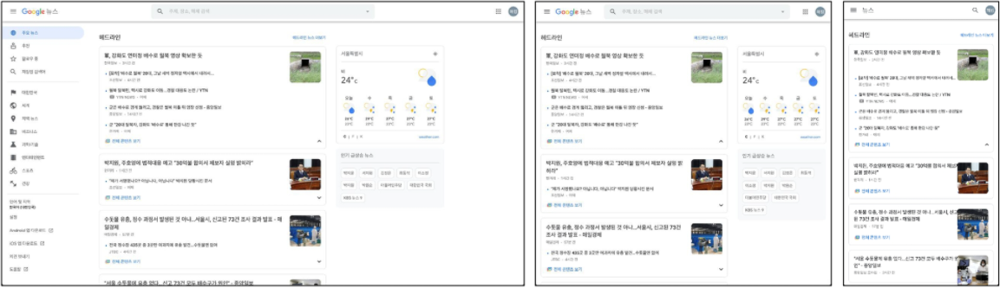

##### · 다양한 화면 크기를 가진 디바이스들이 등장함에 따라 responsive web design 개념이 등장

##### · 반응형 웹은 별도의 기술 이름이 아닌 웹 디자인에 대한 접근 방식

##### · 반응형 레이아웃 작성에 도움이 되는 사례들의 모음 등을 기술하는데 사용되는 용어

##### · 예시

> · Media Queries,  Flexbox,  Bootstrap Grid System,  The viewport meta tag


## Bootstrap Grid System

### Grid system

##### · Bootstrap Grid system은 flexbox로 제작됨

##### · container, rows, column으로 컨텐츠를 배치하고 정렬

##### · 반드시 기억해야 할 2가지

> ·  12개의 column  
> ·  6개의 grid breakpoints

```html
<!-- Grid System 구조 -->

<div class="container">
  <div class="row">
    <div class="col"></div>
    <div class="col"></div>
    <div class="col"></div>
  </div>
</div>
```

### Grid system breakpoints

|                           | xs          | sm       | md       | lg       | xl       | xxl       |
| ------------------------- | ----------- | -------- | -------- | -------- | -------- | --------- |
| **Container (max-width)** | None (auto) | 540px    | 720px    | 960px    | 1140px   | 1320px    |
| **Class prefix**          | .col-       | .col-sm- | .col-md- | .col-lg- | .col-xl- | .col-xxl- |
| **min-width**             | ＜ 576px    | ≥ 576px  | ≥ 768px  | ≥ 992px  | ≥ 1200px | ≥ 1400px  |

```css
@media (min-width: 576px) {
  .container-sm, .container {
    max-width: 540px;
  }
}
@media (min-width: 576px) {
  .container-sm, .container-sm, .container {
    max-width: 540px;
  }
}
@media (min-width: 576px) {
  .container-sm, .container-md, .container-sm, .container {
    max-width: 540px;
  }
}
@media (min-width: 576px) {
  .container-sm, .container-lg, .container-md, .container-sm, .container {
    max-width: 540px;
  }
}
@media (min-width: 576px) {
  .container-sm, .container-xl, .container-lg, .container-md, .container-sm, .container {
    max-width: 540px;
  }
}
```

### Grid system 연습

```html
<!-- 연습 1 -->

<div class="container">
  <h2 class="text-center">column</h2>
  <div class="row">
    <div class="box col">1</div>
    <div class="box col">2</div>
    <div class="box col">3</div>
  </div>
  <hr>
  
  <div class="row">
    <div class="box col">1</div>
    <div class="box col">2</div>
    <div class="w-100"></div>
    <div class="box col">3</div>
    <div class="box col">4</div>
  </div>
  <hr>
</div>
```

> 

```html
<!-- 연습 2 -->

<div class="row">
  <div class="box col-3">1</div>
  <div class="box col-6">2</div>
  <div class="box col-3">3</div>
</div>
<hr>

<div class="row">
  <div class="box col-1">1</div>
  <div class="box col-1">2</div>
  <div class="box col-1">3</div>
  <div class="box col-1">4</div>
  <div class="box col-1">5</div>
  <div class="box col-1">6</div>
  <div class="box col-1">7</div>
  <div class="box col-1">8</div>
  <div class="box col-1">9</div>
  <div class="box col-1">10</div>
  <div class="box col-1">11</div>
  <div class="box col-1">12</div>
  <div class="box col-1">13</div>
</div>
```

> 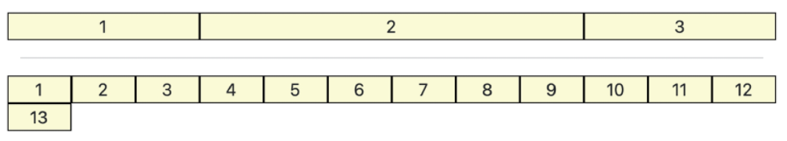

```html
<!-- 연습 3 -->

<div class="row">
  <div class="box col-9">col-9</div>
  <div class="box col-4">col-4</div>
  <div class="box col-3">col-3</div>
</div>
<hr>
```

> 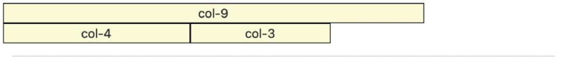

```html
<!-- 연습 4 -->

<h2 class="text-center">Grid breakpoints</h2>
<div class="row">
  <div class="box col-2 col-sm-8 col-md-4 col-lg-5">1</div>
  <div class="box col-8 col-sm-2 col-md-4 col-lg-2">1</div>
  <div class="box col-2 col-sm-2 col-md-4 col-lg-5">1</div>
</div>
<hr>

<h2 class="text-center">nesting</h2>
<div class="row">
  <div class="box col-6">
    <div class="row">
      <div class="box col-3">1</div>
      <div class="box col-3">2</div>
      <div class="box col-3">3</div>
      <div class="box col-3">4</div>
    </div>
  </div>
  <div class="box col-6">1</div>
  <div class="box col-6">2</div>
  <div class="box col-6">3</div>
</div>
<hr>

<h2 class="text-center">offset</h2>
<div class="row">
  <div class="box col-md-4 offset-4">.col-md-4 .offset-4</div>
  <div class="box col-md-4 offset-md-4 offset-lg-2">.col-md-4 .offset-md-4 .offset-lg-2</div>
</div>
<hr>
```

> 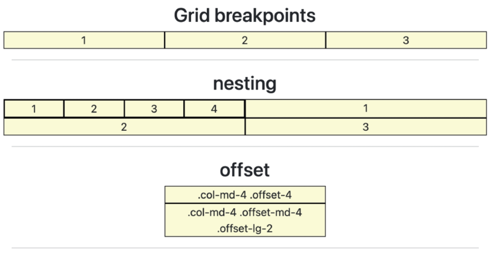

```html
<!-- 연습 5 -->

<h2 class="text-center">alignment</h2>
<div class="row parent justify-content-center align-items-center">
  <div class="box col-4">justify-content-center / align-items-center</div>
</div>
<hr>
```

> 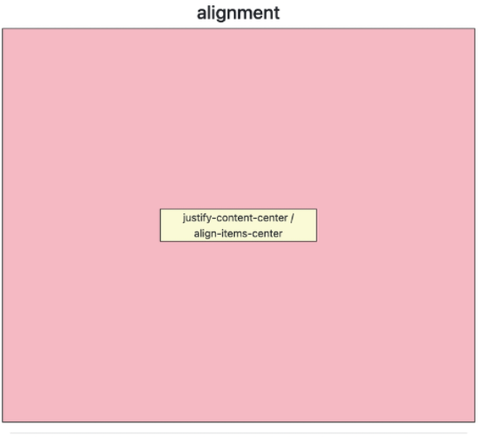

```html
<!-- 연습 6 -->

<div class="row parent">
  <div class="box col-4 align-self-start">1</div>
  <div class="box col-4 align-self-center">2</div>
  <div class="box col-4 align-self-end">3</div>
</div>
```

> 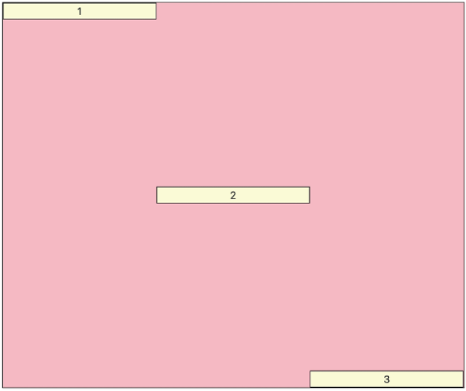


